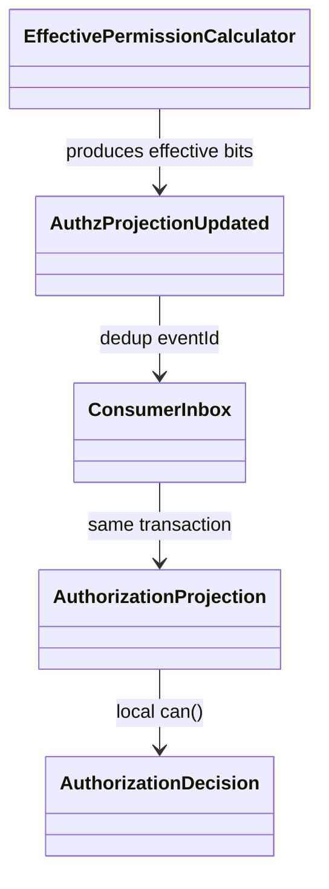
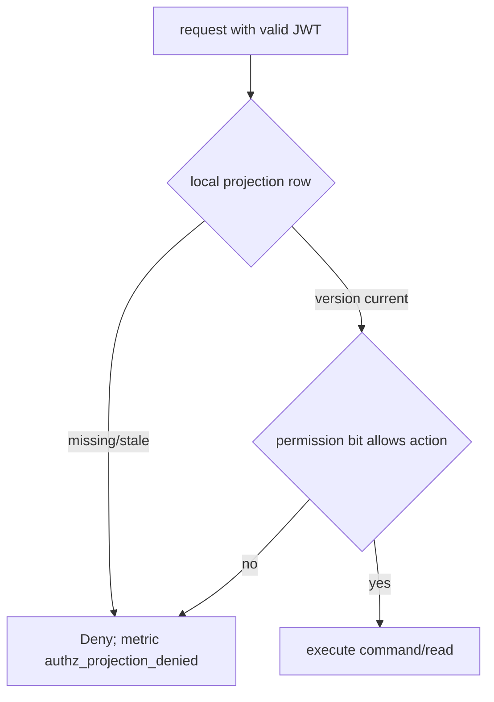

# T171-C2 RBAC Projection 계약 및 첫 구현

## Approval Gate

- Status: Approved
- Approver: 사용자 T171-C target-state 결정 및 C0 acceptance 승인
- Blocking ambiguity: 없음
- 선택 branch: Community가 권한 원본·계산을 소유하고, `AuthzProjectionUpdated` versioned event를 발행한다. 각 서비스는 자기 DB에 projection을 저장하고 local `can()`으로 판정한다.
- 제외 branch: 요청마다 Community 동기호출, 공유 Redis 권한 세션, JWT에 guild/channel permission 전체 삽입.

## Goal

- `community`의 현재 Guild/Role/Overwrite 계산을 서비스 간 공통 권한 계약으로 만든다.
- `message`, `websocket`, Gateway Control, Notification이 동기 네트워크 호출 없이 자기 projection으로 권한을 판정한다.
- 권한 변경은 at-least-once Kafka와 inbox dedup으로 전파하고, 오래된 이벤트가 최신 projection을 덮어쓰지 못하게 한다.

## Non-goals

- 이번 task에서 Guild aggregate 자체를 서비스 DB로 분리하지 않는다.
- Spring Session Redis, 권한 전용 Redis 공유 세션, gRPC 권한 조회를 추가하지 않는다.
- 모든 기존 controller를 한 번에 projection 기반으로 교체하지 않는다. 첫 구현은 계약·producer·공통 projection consumer와 한 개 mutation/read 경로로 제한한다.

## Domain Language

| 용어 | 의미 | 코드 식별자 |
|---|---|---|
| 권한 원본 | Guild role/member/overwrite와 effective permission 계산의 단일 소유자 | `Guild`, `Role`, `EffectivePermissionCalculator` |
| projection | 서비스 DB에 복제된 subject/resource별 effective permission read model | `AuthorizationProjection` |
| permissionVersion | guild별 단조 증가하는 권한 변경 버전 | `long` |
| authz event | 원본 eventId와 projection 결과를 담은 versioned Kafka envelope | `AuthzProjectionUpdated` |
| fail-closed | projection 부재·stale·version 충돌 시 보호된 요청을 거부 | `AuthorizationDecision.DENY` |

## Current Evidence

- 현재 권한 계산은 `backend/modules/permission/.../EffectivePermissionCalculator.java`와 `PermissionSet`에 있다.
- 현재 영속 원본은 `backend/boot/.../PersistentGuildService.java`와 `JdbcGuildSnapshotStore.java`가 V1 Guild/Role/Member/Overwrite 테이블에 저장한다.
- 현재 독립 서비스용 `authorization_projection`, authz event producer, inbox consumer는 없다.
- C0 승인 계약은 각 서비스 projection, `permissionVersion`, eventId 보존, inbox·projection 동일 transaction, P0/P1 없는 acceptance evidence를 요구한다.

## Contract

### Kafka envelope

Topic: `discord.authz.{service}.v1` per consumer (`message`, `websocket`, `gateway`, `notification`)
Partition key: `guildId`
Consumer group: `authz-projection-{service}`

```json
{
  "schema": "authz.projection.v1",
  "eventId": "UUID",
  "guildId": "UUID",
  "subjectId": "UUID",
  "resourceType": "GUILD|CHANNEL",
  "resourceId": "UUID",
  "permissionBits": "long",
  "permissionVersion": "long",
  "audience": "MESSAGE|WEBSOCKET|GATEWAY|NOTIFICATION",
  "source": "community",
  "occurredAt": "RFC3339",
  "correlationId": "UUID"
}
```

- `eventId`는 producer 생성 후 모든 retry/DLQ/consumer inbox에 동일하게 보존한다.
- `permissionVersion`은 guild별 단조 증가이며, consumer는 기존 version보다 작거나 같은 payload를 no-op 처리한다.
- producer는 audience별 topic에 해당 서비스가 필요한 subject/resource 행만 기록한다. 다른 서비스의 권한 행을 공용 topic으로 fanout하지 않는다.
- `permissionBits`는 `EffectivePermissionCalculator`의 결과이며 role/overwrite 원본을 consumer에 재계산시키지 않는다.
- unknown schema, malformed UUID, negative version, hash/size 오류는 mutation 없이 metadata-only DLQ로 보낸다. DLQ metadata의 subject/resource는 truncated SHA-256으로 마스킹하고 raw event/token/body는 보관하지 않는다. 보존 기간은 7일이다.
- `AuthzProjectionRemoved`는 동일 envelope에 `permissionBits=0`과 증가한 version을 사용한다. 별도 삭제 의미를 만들지 않는다.

`AuthzGuildWatermarkAdvanced`는 같은 audience topic의 guild partition 마지막에 발행된다. `subjectId/resourceId` 없이 `guildId`와 `permissionVersion`만 담으며, consumer가 `authorization_watermark`를 갱신한다. projection row의 version이 watermark보다 낮거나 watermark가 없으면 요청을 deny한다. 이 watermark가 request-time stale 판정의 유일한 source다.

### Local projection schema

각 서비스 DB에 동일 의미의 service-owned table을 둔다.

```sql
authorization_projection(
  guild_id uuid not null,
  subject_id uuid not null,
  resource_type varchar(16) not null,
  resource_id uuid not null,
  permission_bits bigint not null,
  permission_version bigint not null,
  updated_at timestamptz not null,
  primary key (guild_id, subject_id, resource_type, resource_id)
)

authorization_watermark(
  guild_id uuid primary key,
  permission_version bigint not null,
  updated_at timestamptz not null
)
```

`consumer_inbox(consumer_name, event_id)` unique key와 projection upsert는 하나의 DB transaction이다. `permission_version` 비교는 SQL 조건부 upsert로 원자화한다.

## Participating Code

| 영역 | 책임 | 첫 구현 경계 |
|---|---|---|
| `backend/modules/permission` | framework-free envelope/value/decision/bit contract | record, parser validation, stale/fail-closed rule |
| Community boot | Guild mutation 후 projection event를 outbox에 append | `PersistentGuildService`가 before/after diff를 만들고 `JdbcGuildSnapshotStore.save(guild, changes)`가 source row, guild version, outbox를 같은 JDBC transaction으로 commit |
| Shared event adapter | Kafka serializer, ACK timeout, topic/key/header | C0 eventId/ACK 계약 재사용 |
| Service consumers | inbox dedup + conditional projection upsert | message와 websocket을 첫 consumer로 선택 |
| Protected read/mutation path | local projection `can()` 호출 | channel visibility 또는 message send 한 경로부터 교체 |

## Tier And Layer Responsibilities

- Domain: permission bit calculation, event value validation, decision semantics만 담당한다.
- Boot/application: Guild mutation과 outbox append의 transaction 경계를 소유한다.
- Persistence: Community 원본 테이블과 각 서비스 projection/inbox를 분리한다.
- Infrastructure: Kafka delivery, retry, DLQ, metrics를 소유한다.
- Service API: remote authz lookup 없이 local projection을 읽고 stale이면 deny한다.

## Structure Diagram



## System Flow Diagram

```mermaid
flowchart LR
    M[Community Guild mutation] --> C[EffectivePermissionCalculator]
    C --> O[Transactional Outbox]
    O --> K[Kafka discord.authz.{service}.v1]
    K --> I[Service inbox]
    I --> P[Service authorization_projection + watermark]
    P --> D[Local can decision]
```

## Behavior Flow



## Invariants And Boundaries

- Auth/security: JWT verifies identity; projection verifies resource permission. JWT에는 guild/channel permission을 넣지 않는다.
- Consistency: projection은 eventual consistency다. `authorization_watermark`가 없거나 row version이 watermark보다 낮으면 stale로 보고 보호된 read/mutation을 fail-closed한다. watermark와 row가 모두 같은 version이면 allow/deny bit를 평가한다.
- Ordering: Kafka key는 guildId이며 permissionVersion 비교가 cross-partition 재전송을 방어한다.
- Idempotency: `(consumer_name,event_id)` unique와 conditional upsert로 business side effect를 1회로 만든다.
- Privacy: audience별 topic에는 해당 서비스에 필요한 permission row만 보낸다. event와 DLQ에는 message body, token, cookie, authorization header를 넣지 않고 DLQ 식별자는 truncated SHA-256으로 마스킹한다.
- Rollback: old synchronous/local path를 feature flag로 유지하고 projection freshness·deny spike를 관측한 뒤 전환한다.

## Expected Changed Files

- `backend/modules/permission/src/main/java/.../AuthzProjectionUpdated.java`: immutable event contract and validation.
- `backend/modules/permission/src/main/java/.../AuthorizationDecision.java`: allow/deny/stale semantics.
- `backend/boot/src/main/resources/db/migration/V17__authorization_outbox.sql`: source outbox와 guild watermark/version additive schema.
- `backend/boot/src/main/java/com/example/discord/guild/GuildSnapshotStore.java`: `save(guild, changes)` transaction API를 추가한다.
- `backend/boot/src/main/java/com/example/discord/guild/JdbcGuildSnapshotStore.java`: source snapshot, version increment, audience별 outbox insert를 같은 JDBC connection에서 commit한다.
- `backend/boot/src/main/java/com/example/discord/guild/PersistentGuildService.java`: mutation 전 snapshot과 후 snapshot diff를 계산해 store에 전달한다.
- `backend/services/message/build.gradle.kts`, `backend/services/websocket/build.gradle.kts`: Kafka/JDBC projection 의존성과 service-owned migration 경계를 명시한다.
- `backend/services/message/src/main/resources/db/migration/V1__authorization_projection.sql`, `backend/services/websocket/src/main/resources/db/migration/V1__authorization_projection.sql`: projection/inbox/watermark schema.
- `backend/services/message/src/main/java/...`: message audience consumer and protected path adapter.
- `backend/services/websocket/src/main/java/...`: websocket audience consumer and protected path adapter.
- `backend/boot/src/test/java/...`: source version/order/outbox atomicity tests.
- `backend/services/message/src/test/java/...`, `backend/services/websocket/src/test/java/...`: duplicate, stale/missing watermark, deny/allow tests.
- `docs/03-analysis/T171-C2-rbac-projection-review.md`: independent spec/quality review evidence.

## Implementation Steps

1. Add framework-free event/decision records and validation tests.
2. Add additive source/service schemas and repository tests for outbox, inbox, watermark, conditional version upsert.
3. Make `JdbcGuildSnapshotStore.save(guild, changes)` atomically persist Guild rows, guild `permissionVersion`, audience events, and watermark event in one JDBC transaction; rollback must leave all four unchanged.
4. Implement message consumer, then websocket consumer; each has own group and DB transaction.
5. Replace one protected path with local `can()` and fail-closed stale handling.
6. Run duplicate/out-of-order/replay/failure drills and record evidence.

## Verification Gates

- Focused: permission module tests; boot Guild/outbox transaction tests; message/websocket consumer tests.
- Contract: event schema fixture, eventId preservation, key/version ordering, no secret/body DLQ assertion.
- Runtime: Kafka unavailable, duplicate delivery, out-of-order version, projection DB unavailable, stale deny, rollback flag.
- Review: plan >=85; security >=90; implementation quality >=80; P0/P1 0.

## Residual Risks

- Projection fanout volume grows with guild members × channels; measure before adding compacted snapshots or sharding.
- Existing boot monolith and independent services may temporarily have two authorization paths; feature flag and metric parity are mandatory.
- This plan does not claim implementation completion or PR readiness.
