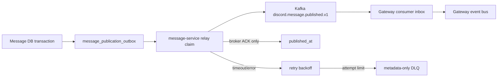

# T171-C Message service Kafka outbox blueprint

## Approval Gate
- Status: Approved
- Approver: user request (T171-C Kafka outbox path)
- Blocking ambiguity: none for the requested eventId/ACK/inbox/retry-DLQ slice
- Competing plan branches: none

## Goal
- `MessagePublished.eventId` remains unchanged from the message outbox through Kafka and Gateway.
- `published_at` is written only after the producer future reports broker acceptance.
- The message-service runtime has real PostgreSQL outbox relay and Kafka producer wiring; Gateway consumes the versioned record with inbox deduplication and metadata-only retry/DLQ handling.

## Non-goals
- `contentSnapshot`/`visibilityVersion` contract expansion.
- Gateway-service extraction, Kubernetes, mTLS, and durable Gateway cursor work.

## Participating Code
- `backend/modules/message`: immutable `MessagePublishedRecord` wire carrier and existing relay contract.
- `backend/services/message`: PostgreSQL outbox queue, Kafka dispatcher, relay worker, profile/config wiring.
- `backend/boot`: Kafka message dispatcher/consumer, inbox adapter, Gateway handoff, retry/DLQ configuration.

## System Flow

## Invariants
- `eventId` is immutable and is the Kafka record field, Gateway command source ID, and inbox key.
- Kafka key is `channelId`; message body is not placed in the record or DLQ.
- Failed/timed-out send futures throw before relay completion; the outbox row remains retryable.
- Duplicate consumer delivery produces no second Gateway side effect.
- Malformed/unknown records and exhausted retries expose only safe metadata.

## Expected Changed Files
- `backend/modules/message/src/main/java/com/example/discord/message/MessagePublishedRecord.java`
- `backend/services/message/src/main/java/com/example/discord/messageservice/JdbcMessagePublicationOutbox.java`
- `backend/services/message/src/main/java/com/example/discord/messageservice/KafkaMessagePublishedDispatcher.java`
- `backend/services/message/src/main/java/com/example/discord/messageservice/MessagePublicationRuntimeConfiguration.java`
- `backend/services/message/src/main/resources/db/migration/V2__message_publication_outbox.sql`
- `backend/services/message/src/main/resources/application-kafka.yml`
- `backend/services/message/src/test/java/com/example/discord/messageservice/MessagePublicationRuntimeTest.java`
- `backend/boot/src/main/java/com/example/discord/message/KafkaMessagePublishedDispatcher.java`
- `backend/boot/src/main/java/com/example/discord/message/KafkaMessagePublishedConsumer.java`
- `backend/boot/src/main/java/com/example/discord/message/MessagePublicationInbox.java`
- `backend/boot/src/main/java/com/example/discord/message/JdbcMessagePublicationInbox.java`
- `backend/boot/src/main/java/com/example/discord/message/InMemoryMessagePublicationInbox.java`
- `backend/boot/src/main/java/com/example/discord/message/MessageKafkaConfiguration.java`
- focused tests under `backend/boot/src/test` and `backend/modules/message/src/test`

## Verification Gates
- Focused module relay test: success marks only after dispatch; failure releases for retry and eventually reaches DLQ.
- Message-service runtime test: Kafka record uses `channelId` key, preserves source eventId, and does not mark on failed future.
- Boot consumer test: duplicate eventId is one Gateway side effect; malformed input goes to metadata-only DLQ; listener failure is retryable.
- Opt-in central smoke: a live Redpanda broker accepts the record, the relay marks the claimed event, and the consumed record keeps the original eventId and channel key.
- Commands: `./gradlew :backend:modules:message:test :backend:services:message:test :backend:boot:test --tests ...`, then `./gradlew test` and `git diff --check`.

## Review Contract
- Preset: Implementation Review
- Pass threshold: 80/100, no P0/P1, no category below half credit.
