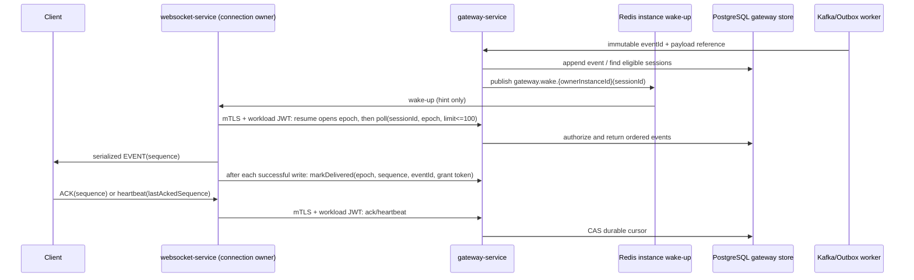

# T171-C 분산 런타임·Gateway ACK 아키텍처 결정

## 승인·적용 범위

- 상태: 사용자 승인 후 세부 설계 재검수 중. 이 문서는 구현 착수의 기준이며, 검수에서 모호성이 발견되면 수정 후 재검수한다.
- 전환 방식: 전면 MSA/DB 분리가 아닌 Strangler 전환이다. 먼저 Gateway control plane과 WebSocket transport를 분리하고, 도메인별 DB 분리는 별도 task로 판단한다.
- 출시 차단 조건: T204 capability admission의 증거가 없으면 Kubernetes production rollout을 하지 않는다. 코드·단위 테스트는 가능하나 추정한 cluster 값으로 manifest를 만들지 않는다.

## 목표와 비목표

목표는 HTTP, WebSocket 연결, Gateway protocol, broker relay의 replica와 장애 영역을 분리하면서 재시작·scale-out·drain 뒤에도 안전하게 재전송하는 것이다.

이번 범위에서 exactly-once, 전역 순서, service mesh 선도입, 모든 도메인의 DB 분리는 만들지 않는다. 순서는 ordering key별로만 보장한다: 메시지는 `channelId`, membership/permission은 `guildId`, identity 알림은 `userId`다.

## 현재 결함과 전환 후 책임

| 현재 결함 | 결정 |
| --- | --- |
| Nginx `/ws/`는 `websocket-service`로 보내지만 실제 handler는 `boot`에 있음 | WebSocket transport의 단일 owner는 `websocket-service`다. Nginx는 원 URI를 보존하고 handler는 `/ws/gateway`를 소유한다. |
| `InMemoryGatewayService`가 노드별 sequence/window/dedup을 가짐 | production sequence와 ACK cursor는 PostgreSQL Gateway store가 소유한다. 메모리는 socket 연결과 write queue만 가진다. |
| `lastDeliveredSequence`가 client ACK와 혼재 | durable `acknowledgedSequence`와 `highestDeliveredSequence`를 분리한다. 후자는 socket write 성공 뒤에만 기록한다. |
| Kafka producer future를 기다리지 않음 | producer broker ACK 성공 뒤에만 Outbox row를 published로 표시한다. |

| Runtime | 소유 | 소유하지 않음 |
| --- | --- | --- |
| API/Community/Message/Identity | public HTTP, user JWT 검증, domain transaction | physical WebSocket, workload shared secret |
| Gateway control | identify/resume/heartbeat/ACK, authorization-at-delivery, event log, durable delivery cursor | physical socket, process-local sequence |
| WebSocket transport | `/ws/gateway`, upgrade, JWT 검증, frame parsing, 연결 map, 직렬 write, wake-up subscription, drain | event history, ACK truth, Redis stream/PEL 소비 |
| Relay/Worker | Outbox lease, Kafka publish/consume, durable consumer inbox, quarantine | client socket, 무한 retry |
| PostgreSQL | domain/outbox/event log/session delivery/inbox | ephemeral connection owner |
| Redis | session lease, connection-owner hint, instance wake-up Pub/Sub | replay retention, ACK authority |
| Kafka | service 간 durable event transport, key별 partition order | client session/ACK state |

## 신원·네트워크 경계

| 신원 | 출처 | 수락 지점 | 필수 검증 |
| --- | --- | --- | --- |
| User | identity-service Ed25519 access JWT | public API, WebSocket transport | issuer/audience/kid/exp/UUID subject |
| Client source address | trusted ingress의 immediate peer와 T171-A proxy policy | edge rate-limit/abuse 정책만 | allowlisted peer가 아니면 forwarded header 무시; 원문 주소는 로그·UI·metric label에 넣지 않음 |
| Workload | projected Kubernetes ServiceAccount JWT + mTLS client certificate | internal endpoint | exact issuer, `aud=discord.internal`, exp, namespace+SA+route allowlist, 인증서 체인/SAN |

Workload identity는 user identity가 아니다. websocket-service는 검증한 user UUID와 correlation ID를 Gateway로 전달할 수 있지만 user JWT를 전달하거나 새 user subject를 만들 수 없다. 기존 `X-Internal-Gateway-Publisher`는 T210 negative compatibility test가 통과한 뒤 제거한다.

## Gateway delivery 상태 기계

### R1 확정: 사용자 delivery stream 모델

Gateway event log의 `sequence`는 append commit 순서의 전역 단조값이다. 이 값은 관찰·감사·중복 식별용이며 client ACK cursor가 아니다. append transaction은 대상 사용자마다 `gateway_user_delivery(user_id, user_sequence, event_id, event_sequence, stream_key, visibility_version, expires_at)`를 materialize한다. 기본키는 `(user_id,user_sequence)`, event 중복 방지는 `(user_id,event_id)` unique다. `user_sequence`는 사용자 stream별 단조값이므로 같은 channel/guild/user ordering key의 순서는 보존되고, 서로 다른 key는 전역 commit 순서로 더 강하게 직렬화된다.

session cursor·grant·ACK는 전부 `user_sequence`를 사용한다. `poll`은 `user_sequence > acknowledged_sequence`의 아직 grant되지 않은 row를 최대 100/256 KiB로 선택하고 `(user_id,user_sequence)` index를 사용한다. visibility_version이 현재 권한과 달라 접근이 사라졌으면 Gateway가 그 row를 `SKIPPED`로 기록하고 cursor를 서버 측에서 전진시킨다. client ACK는 권한 필터 때문에 건너뛴 row를 승인하지 않는다.

`identify`와 `RESYNC_REQUIRED` 완료는 authorized snapshot read model version과 해당 user stream high watermark를 한 PostgreSQL transaction/snapshot에서 읽고, `acknowledged=highestGranted=highestDelivered=watermark`로 새 session을 만든다. snapshot 이후 append는 watermark 다음 user_sequence로 poll한다. 따라서 신규 identify는 history를 재전송하거나 즉시 retention 오류가 되지 않는다.

각 session은 PostgreSQL의 `gateway_session_delivery` 한 행(`primary key(session_id,user_id)`)으로 다음을 소유한다: `delivery_epoch`, `owner_instance_id`, `owner_lease_expires_at`, `acknowledged_sequence`, `highest_granted_sequence`, `highest_delivered_sequence`, `version`, `updated_at`, `expires_at`. `highest_delivered_sequence`은 **성공적으로 socket에 쓴** 최대 sequence이며, `acknowledged_sequence <= highest_delivered_sequence <= highest_granted_sequence` 불변식을 DB compare-and-set으로 지킨다. `gateway_delivery_grant(session_id,user_id,delivery_epoch,sequence,event_id,delivery_token_hash,position,expires_at)`는 `(session_id,user_id,delivery_epoch,sequence)` unique이며 current epoch에 Gateway가 실제 반환한 event만 증명한다.

| 명령 | 입력 | 성공 결과 | 거부/멱등 규칙 |
| --- | --- | --- | --- |
| `identify` | verified `userId` | session과 `ack=0`, `highestDelivered=0` 생성 | 새 logical session 생성 |
| `resume` | `sessionId`, verified `userId`, transport instance ID, client `lastAckedSequence` | owner lease를 원자 교체하고 `deliveryEpoch+1`, grants 삭제, highest grant/delivered를 저장 ACK로 reset | client 값이 저장 ACK보다 크면 `ACK_OUT_OF_RANGE`; retention 밖이면 `RESYNC_REQUIRED` |
| `poll` | session/user/current epoch/owner, limit | Gateway가 authorise한 최대 100개를 grant token과 함께 반환 | `afterSequence` client 입력은 없다; active grant는 동일 결과를 재반환 |
| `markDelivered` | session/user/epoch/sequence/eventId/delivery token/owner | current epoch의 다음 unmarked grant만 `highestDelivered`로 확정 | old epoch/owner, token/eventId 불일치, 순서 건너뜀은 거부; write 실패면 호출 금지 |
| `ack` | session/user/epoch/sequence/transport instance ID | `acknowledgedSequence=max(current, sequence)` | current owner lease/epoch 불일치 또는 `sequence > highestDelivered`는 거부; `sequence <= current`는 stale duplicate success(no-op) |
| `heartbeat` | session/user/epoch/client lastAck/transport instance ID | owner lease 갱신 후 내부적으로 `ack` 규칙 적용 | old/other owner 또는 범위 밖 ACK는 heartbeat도 실패시킴 |

`markDelivered`와 `ack`는 `version` CAS 재시도 후에도 단조 증가만 허용한다. transport는 연결 단위 single-writer queue로 frame을 직렬화하고, write completion 성공 후에만 `markDelivered`를 호출한다. 프로세스 종료·write 실패·timeout은 mark를 남기지 않는다. 재접속하거나 다른 pod로 이동하면 `resume`이 이전 epoch grants를 폐기하고 저장 ACK에서 새 grant를 만들므로, 중복 frame은 가능하지만 미전송 event를 ACK로 건너뛰거나 이전 owner가 ACK 범위를 재사용할 수 없다.

`GatewayEventLog.append(eventId, orderingKey, scope, payloadRef)`만 sequence를 발급한다. `event_id`는 Outbox부터 Gateway까지 불변 UUID이고 unique다. 동일 eventId와 다른 payload hash는 충돌로 격리한다. event log는 retention 후 `expires_at`으로 정리하며, 요청 cursor가 가장 오래 보관한 sequence보다 작으면 `RESYNC_REQUIRED`를 반환한다. replay/poll 시점에 channel membership과 visibility를 재평가한다.

## 전송·wake-up 흐름

Redis wake-up은 손실되어도 correctness에 영향을 주지 않는 힌트다. websocket-service는 각 live session을 최대 1초 간격으로 bounded poll하고, wake-up은 즉시 poll을 앞당긴다. `poll`은 최대 100 event 또는 256 KiB 중 먼저 도달한 값까지만 반환한다. 연결별 pending write queue가 256 KiB/100 frame을 넘으면 새 event를 poll하지 않고 close code `1013`과 `RECONNECT`를 보낸다. `gateway.wake.{instanceId}` 구독 재시작은 Redis session owner lease(transport가 heartbeat로 갱신)를 다시 등록한다.

### Internal control wire schema

모든 request는 mTLS와 workload JWT를 통과한 뒤 처리한다. `resume` request는 `{sessionId,userId,transportInstanceId,lastAckedSequence}`이고 response는 `{deliveryEpoch,acknowledgedSequence}`다. `poll` request는 `{sessionId,userId,deliveryEpoch,transportInstanceId,limit}`이고 response event는 `{sequence,eventId,payloadRef,deliveryToken}`다. `delivered`, `ack`, `heartbeat` 모두 `transportInstanceId`와 epoch를 포함한다. `deliveryToken`은 256-bit CSPRNG 값이고 DB에는 hash만 저장하며 client frame/log/metric에 절대 넣지 않는다. 오류는 `{code,correlationId}`이며 `ACK_OUT_OF_RANGE`, `STALE_DELIVERY_EPOCH`, `DELIVERY_OWNER_MISMATCH`, `DELIVERY_GRANT_INVALID`, `RESYNC_REQUIRED`만 protocol state를 노출한다. `RESYNC_REQUIRED` client action은 socket을 유지한 채 authorized HTTP snapshot을 재조회한 후 새 `identify`로 session을 만든다.

Gateway 내부 API는 public ingress에 노출하지 않는다. `gateway-control` Service는 `ClusterIP`; runtime ingress에는 `/api`와 `/ws`만 있다. `gateway-control-network-policy`의 ingress allow는 같은 namespace의 fixed websocket caller label과 fixed operator caller label뿐이다. 표준 NetworkPolicy는 port까지만 제한하며, application filter가 websocket cert+SA는 Gateway route만, operator cert+SA는 DLQ route만 수락한다.

## Outbox·consumer·DLQ 계약

### R1 확정: 단일 publish·fan-out 경로

`MessagePublicationRelayWorker → KafkaMessagePublishedDispatcher → discord.message.published.v1 → gateway-service(group gateway-service-v1) → gateway_event_log + gateway_user_delivery → Redis Pub/Sub wake-up`만 Message delivery 경로다. Kafka record는 versioned JSON `{schemaVersion:1,eventId,messageId,guildId,channelId,correlationId,occurredAt,payloadHash}`이며 key는 `channelId`다. Gateway는 shared-DB 전환 동안 `MessageLookupPort` JDBC adapter로 immutable message snapshot을 읽어 hash를 재검증한다. hash 불일치/unknown version은 Kafka DLQ metadata-only record로 보내며 event를 append하지 않는다. Redis Stream/PEL은 이 경로에서 제거한다; Redis는 owner-specific Pub/Sub wake-up과 owner lease만 가진다.

## Migration owner

공유 DB 전환 동안 Flyway resource의 단일 경로는 `backend/shared/persistence-migrations/src/main/resources/db/migration/`이고, production migrate owner는 boot 하나다. V1부터 V17까지 그 경로에 둔다. gateway-service는 Flyway migrate를 절대 실행하지 않고 startup schema-version validation만 수행하며 불일치면 readiness false다. DB 분리와 gateway-owned migration은 별도 task다.

| 단계 | 성공 기준 | 실패 처리 |
| --- | --- | --- |
| domain write | domain row + idempotency + Outbox가 한 PostgreSQL transaction | 동일 idempotency key는 기존 결과 |
| Kafka publish | `send(...).get(timeout)` broker ACK 성공 | lease를 retry delay로 반납; `published_at` 금지 |
| Gateway append | original `eventId` unique append | 같은 ID는 original sequence 반환 |
| consumer side effect | side effect + `gateway_delivery_inbox(event_id, consumer_name)` 한 transaction | duplicate marker면 no-op |
| Redis PEL | 성공 또는 안전 metadata quarantine 기록 뒤 XACK | retryable은 pending으로 두고 reclaim |

DLQ operator API는 public API가 아니다. `gateway-service`의 `/internal/operator/gateway-delivery-dlq`는 mTLS + projected JWT subject `system:serviceaccount:{namespace}:discord-operator`만 수락하며 ingress는 없다. list는 cursor pagination과 `limit <= 100`만 제공한다. replay 입력은 `eventId` 하나뿐이며 payload를 받지 않는다; 서버가 원 Outbox/event-log record를 재조회하여 동일 `eventId`로 재발행하고 `gateway_delivery_replay_audit`에 caller·time·outcome을 남긴다. 원본이 없거나 이미 성공 처리면 재발행하지 않는다.

## Kubernetes admission 및 mTLS

T204가 선택한 certificate issuer와 OIDC/JWKS만 사용한다. gateway-service는 server certificate/key와 CA trust bundle을 mount하고 `server.ssl.client-auth=need`로 TLS를 연다. websocket-service의 `GatewayControlClient`는 same CA trust bundle과 websocket client certificate/key로 TLS를 연다. hostname은 admission에서 확정한 `gateway-control.{namespace}.svc.cluster.local` SAN과 일치해야 한다. TLS 또는 workload JWT 중 하나라도 없거나 검증 실패하면 internal request를 fail closed하며 HTTP/plaintext fallback은 없다. certificate Secret 갱신은 mounted-file reload 또는 controlled pod restart 중 admission report가 증명한 방식을 사용하고, rotation drill로 검증한다. NetworkPolicy는 L3/L4만 제한하므로 `/internal/operator/**` route 권한은 application workload filter가 별도로 강제한다.

## 완료 기준

- `/ws/gateway`의 handler owner는 websocket-service 하나이며 Nginx compose upgrade test가 이를 증명한다.
- ACK는 `highestDelivered`를 넘을 수 없고 node restart/pod 이동 뒤에도 replay가 가능하다.
- `published_at`은 broker ACK보다 앞설 수 없고 consumer side effect는 eventId별 한 번만 수행된다.
- capability가 없으면 rollout은 명시적으로 실패하며, secret/key/token·원 raw payload는 Git/log/metric/DLQ에 없다.
- 각 task는 독립 spec 및 quality/security review 90점 이상, P0/P1 없음, 선언한 테스트를 통과해야 push/merge 후보가 된다.
