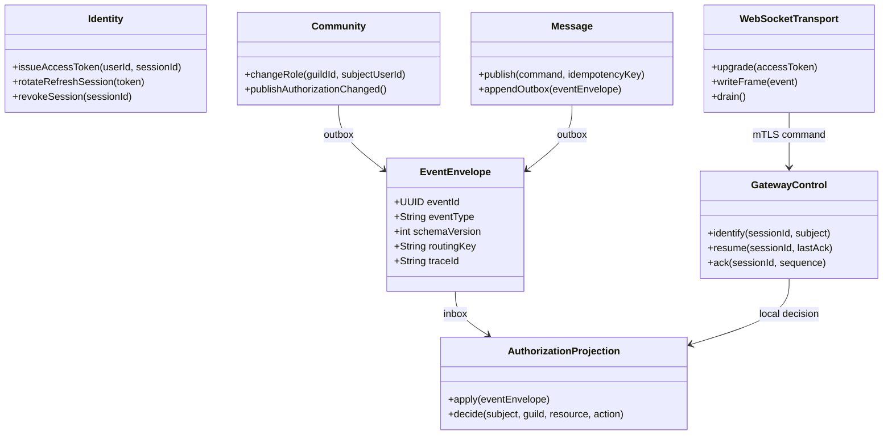
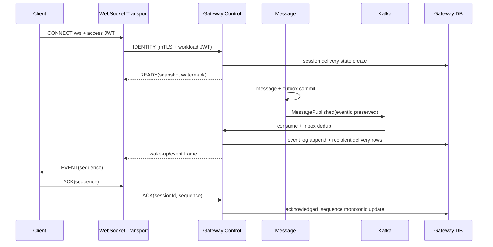
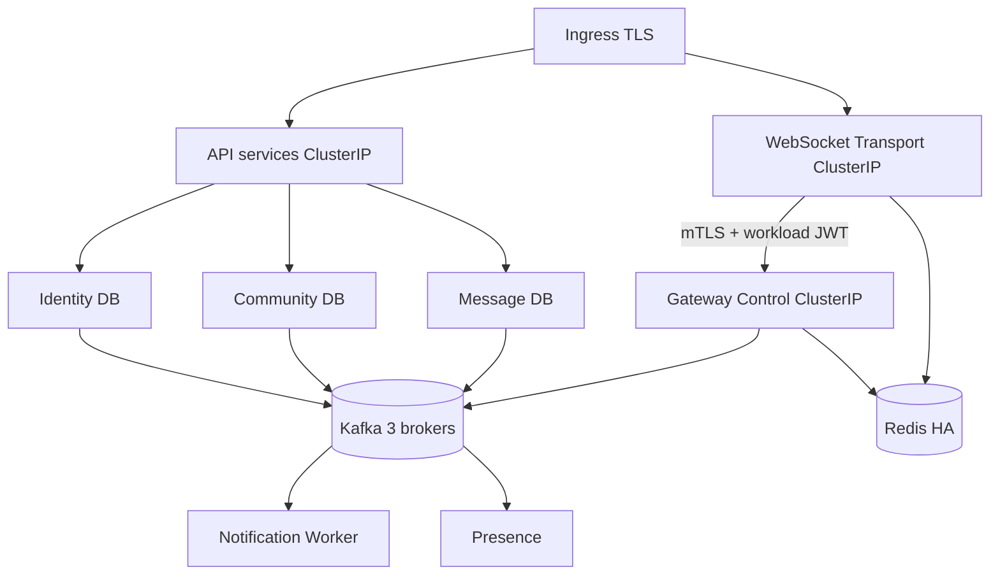

# T171-C0 최종 MSA Target State ADR

상태: Draft (독립 Spec/Security/SRE 검수 전)
작성일: 2026-08-09
범위: 단일 리전에서 서비스별 DB를 소유하는 MSA 최종 목표와 단계별 전환 기준

## 1. 결정 요약

1. 서비스 경계는 Identity, Community, Message, Gateway Control, WebSocket Transport, Presence, Notification Worker, Media/Voice로 나눈다. 현재 boot 모놀리스의 모듈을 즉시 모두 배포 단위로 쪼개지 않고, 아래 전환 순서에 따라 경계를 고정한다.
2. 각 서비스는 자기 데이터베이스만 읽고 쓴다. 다른 서비스의 DB, 테이블, Flyway migration, 내부 repository를 참조하지 않는다.
3. 상태 전파의 기본은 `Transactional Outbox → Kafka at-least-once → consumer inbox dedup`이다. 사용자 명령의 즉시 수락/거부만 동기 처리한다.
4. 인증은 Identity가 발급하는 Ed25519 access JWT와 Identity가 소유하는 DB-backed refresh session을 사용한다. 현재 저장소에 Spring Session 의존성·`SessionRepository`가 없으므로 Spring Session Redis를 도입하지 않는다.
5. Community는 RBAC 원본을 소유하지만 요청마다 Community를 호출하지 않는다. 각 서비스가 자기 DB의 `authorization_projection`을 이용해 독립적으로 인가한다. Redis는 서비스별 선택적 캐시이며 권한 원본·공유 Spring Session 저장소가 아니다.
6. 메시지 데이터의 기본 물리 분할은 `event_date` 일자 RANGE 파티션 안의 `chat_room_id` HASH 서브파티션이다. 실제 shard 수와 routing key는 측정 결과로만 늘린다.
7. 단일 리전에서 API/WS stateless pod, Kafka 3 broker, Redis HA, PostgreSQL primary+2 replica를 운영한다. 리전 간 active-active와 cross-region failover는 이번 목표에서 제외하고, 이벤트 envelope의 `region` 필드만 보존한다.

## 2. 현재 코드 근거와 고정 전제

다음은 저장소에서 확인한 사실이며 추측이 아니다.

| 영역 | 현재 사실 | 설계 영향 |
|---|---|---|
| Access JWT | `identity-service`만 PKCS#8 Ed25519 private key를 보유하고 `discord-identity`/`discord-api`/`kid`를 포함한 JWT를 발급한다. message, community, websocket은 public key map으로 로컬 검증한다. | private key 공유·원격 JWKS·요청별 Identity 호출을 추가하지 않는다. |
| Refresh session | boot의 `V6__auth_refresh_sessions.sql`, `JdbcAuthStore`, `AuthService`가 해시된 refresh token을 DB에 저장하고 rotation/reuse revoke를 수행한다. | Spring Session Redis로 교체하지 않고 Identity DB 소유로 유지한다. |
| Spring Session | build 파일과 코드에 `spring-session`, `SessionRepository`, `RedisIndexedSessionRepository`가 없다. | Redis key/TTL/serialization을 Spring Session 규칙처럼 설계하지 않는다. |
| Redis | boot에 `RedisGatewaySessionRegistry`, `RedisGatewayEventBus`, presence/rate-limit 구현이 있다. | Redis는 기능별 ephemeral store다. Gateway delivery 영속 원본으로 간주하지 않는다. |
| Message | `DefaultPublishMessageUseCase`가 message/idempotency/outbox를 하나의 JDBC transaction으로 저장하고 relay가 claim/lease/retry/DLQ를 처리한다. | Outbox eventId를 끝까지 보존하고 Kafka broker ACK 전까지 published 처리하지 않는다. |
| Gateway | `InMemoryGatewayService`가 session, local sequence, replay를 소유하고 `lastDeliveredSequence`를 server-side cursor로 사용한다. | control plane의 durable delivery state와 WS socket ownership을 분리한다. |
| Runtime | 독립 실행 서비스는 identity, message, community, websocket이며 JWT ConfigMap overlay는 배포 전 template다. | 신규 K8s 리소스는 capability 검증 후에만 추가한다. |

## 3. 최종 서비스 경계

### 3.1 책임과 금지 책임

| 서비스 | 소유 책임 | 금지 책임 |
|---|---|---|
| Identity | 사용자 식별자, credential, access JWT, refresh session family, 계정 전체 revoke version | guild membership/role 판정, 메시지·presence 저장, 다른 서비스 private key 보유 |
| Community | guild, chat room/channel, membership, role, permission definition, RBAC command와 권한 변경 event | Message DB 조회, 요청마다 다른 서비스의 권한을 대신 판정, WS socket 관리 |
| Message | message aggregate, mention, idempotency, publication outbox, message read projection | 사용자 profile join, Community DB join, socket write, JWT private key |
| Gateway Control | user delivery event log, recipient filtering 결과, session delivery cursor, ACK/resume protocol, retention | TCP/WebSocket socket, 사용자 profile 원본, 메시지 원본 DB |
| WebSocket Transport | `/ws` upgrade, frame parse/encode, per-connection write queue, heartbeat, drain | durable event sequence 생성, RBAC 원본, DB transaction, public internal endpoint |
| Presence | online/idle/last-seen TTL state, presence event outbox | user credential, guild membership 원본, durable message history |
| Notification Worker | Kafka consumer, inbox dedup, notification delivery retry/DLQ | user-facing 권한 결정, 다른 서비스 DB 직접 수정 |
| Media/Voice | attachment metadata reference와 LiveKit/token integration | message transaction에 파일 binary 저장, guild RBAC 원본 |

`boot`는 전환 기간 동안 Edge API와 남은 모듈의 호스트로 유지한다. 최종적으로 `boot`가 소유하는 domain DB나 cross-service repository는 없다.

### 3.2 모듈에서 서비스로의 매핑

| 현재 module | 최종 서비스 |
|---|---|
| identity, user credential | Identity |
| guild, channel, permission, invite, social, thread, moderation | Community |
| message | Message |
| gateway | Gateway Control |
| websocket runtime | WebSocket Transport |
| presence | Presence |
| notification, event relay | Notification Worker |
| storage, voice | Media/Voice |
| experience, expression, bot | Community의 독립 aggregate로 시작하고 해당 aggregate가 30일 연속 SLO/부하 기준을 초과할 때만 별도 task로 분리 |

분리 기준을 만족하지 않는 저빈도 aggregate를 별도 network hop으로 만들지 않는다. 이는 최종 경계를 닫고 불필요한 분산을 막는 결정이다.



## 4. 데이터 소유권과 확장 정책

### 4.1 데이터베이스

최종 서비스별 logical database와 DB role은 다음과 같다.

| DB | 주요 테이블 | 쓰기 권한 |
|---|---|---|
| `discord_identity` | `users`, `credentials`, `auth_refresh_sessions`, `account_security_versions`, `authorization_projection` | Identity role만 |
| `discord_community` | `guilds`, `chat_rooms`, `memberships`, `roles`, `role_permissions`, `authorization_outbox` | Community role만 |
| `discord_message` | `messages`, `message_mentions`, `message_idempotency`, `message_publication_outbox`, `message_read_projection`, `consumer_inbox`, `authorization_projection` | Message role만 |
| `discord_gateway` | `gateway_event_log`, `gateway_session_delivery`, `gateway_consumer_inbox`, `gateway_replay_audit`, `authorization_projection` | Gateway Control role만 |
| `discord_presence` | durable audit 최소 행, `authorization_projection`; 현재 hot state는 Redis TTL | Presence role만 |
| `discord_notification` | `notification_inbox`, `notification_attempts`, `notification_dead_letters`, `authorization_projection` | Notification Worker role만 |

초기 단일 리전에서는 위 logical database를 하나의 PostgreSQL HA cluster에 둘 수 있지만 DB role·network policy·migration owner는 분리한다. 서비스 간 SQL cross-database link와 공유 schema는 금지한다. 부하 또는 장애 격리 기준을 충족하면 cluster 단위로 이동하며 애플리케이션 계약은 바뀌지 않는다.

### 4.2 Shard·replica·partition

1. Message의 기준 row에는 `chat_room_id`와 UTC `event_date`를 반드시 저장한다.
2. 초기 physical layout은 `messages_yYYYYmMMdDD` RANGE partition 아래 `chat_room_bucket_00..15` HASH subpartition이다. 날짜 partition 보존기간은 90일, 이후 object storage archive 후 DB에서 삭제한다.
3. routing은 `ShardRoutingPolicy(chatRoomId, eventDate) → shardId` 포트로 추상화한다. 초기에는 shard 0 하나를 선택하고 16 bucket 계산 결과만 기록한다. 운영 중 bucket을 추가할 때는 기존 bucket의 hash를 재배치하지 않고 새 chat room만 새 shard로 보낸다.
4. 다음 중 하나가 15분 이상 지속되면 hot-room 분리 측정을 시작한다: room write QPS 1,000, partition size 50 GB, primary write p99 500 ms, replica lag 5 s. 30일 부하 검증에서 개선이 입증될 때만 shard를 추가한다.
5. 쓰기와 read-after-write는 primary, history/search는 replica를 사용한다. replica lag이 2초를 넘으면 해당 read는 primary로 일시 전환한다. lag 30초 초과 시 경고를 발행하고 신규 history page를 제한한다.
6. Identity/Community/Gateway DB도 시간 기반 audit/event table은 월 RANGE partition을 사용한다. permission/membership의 shard key는 실측 전 `guild_id`이며, 임의로 `user_id` shard를 고정하지 않는다.

### 4.3 Redis 규칙

Redis key namespace는 기능 소유자별로 분리한다: `gw:{nodeId}:*`(Gateway), `presence:*`(Presence), `rate:*`(Edge), `authz-cache:{service}:*`(각 서비스). Spring Session namespace는 만들지 않는다. 모든 Redis 값은 TTL과 장애 시 동작을 코드/운영 문서에 함께 둔다. 권한 캐시 miss 또는 Redis 장애 시 서비스 DB projection을 사용하고, projection도 없으면 쓰기·민감 읽기를 fail-closed 한다.

## 5. 인증·RBAC 결정

### 5.1 JWT와 refresh session

- Access JWT: Ed25519 EdDSA, `iss=discord-identity`, `aud=discord-api`, `sub=UUID`, `sid=UUID`, `authzVersion=long`, `kid`, `iat`, `exp`; TTL 15분.
- Refresh token: opaque 256-bit value, SHA-256 hash만 Identity DB `auth_refresh_sessions`에 저장, 30일 절대 만료, 매 refresh rotation, reuse 발견 시 family 전체 revoke.
- `sid`는 세션 식별자이며 Redis key가 아니다. 서비스는 JWT 서명/issuer/audience/expiry를 로컬 검증하고, 계정 전체 revoke가 필요한 경로에서만 Identity의 `account_security_versions` projection을 확인한다.
- 기존 JWT(현재 `sid`/`authzVersion` 없음)는 C1 전환 기간 동안 `legacy` audience로만 허용하고 만료 시 새 claim token으로 교체한다. legacy 허용 종료 기준은 새 token 발급 비율 99.9%를 7일 연속 달성한 날이다.

#### C1 전환 계약과 acceptance

- 목표 access JWT는 `sid=UUID`(refresh session 식별자)와 `authzVersion=long`(계정 전체 보안 세대)을 필수로 담고 TTL을 15분으로 고정한다. `sid`는 개별 session revoke의 기준이고 `authzVersion`이 현재 projection보다 낮으면 서비스는 토큰을 거부한다.
- refresh는 30일 절대 만료 안에서 매번 rotation한다. session revoke는 해당 refresh session의 추가 refresh를 즉시 거부하고, 계정 전체 revoke는 `authzVersion`을 증가시켜 기존 access JWT를 projection 반영 후 거부한다. 이미 발급된 개별-session access JWT는 최대 15분의 target TTL을 넘겨 허용하지 않는다.
- C0 승인 gate에는 현재 1시간·`sid`/`authzVersion` 누락 legacy token과 standalone 서비스의 revoke gap 재현 결과, 그리고 위 target contract를 검증할 C1 acceptance 증거 계획을 포함한다. C1 구현은 다음 증거가 없으면 통과하지 않는다: (a) 발급 JWT의 claim/type과 `exp-iat <= 900s`, (b) 정상/만료/revoked/reuse refresh와 session/account revoke 결과, (c) legacy 1시간 token의 병행 허용 범위와 99.9%/7일 종료 판정, (d) old/new `kid` overlap·unknown `kid` 거부와 verifier reload.
- 최소 검증 명령과 산출물은 다음으로 고정한다. `./gradlew :backend:services:identity:test :backend:services:community:test :backend:services:message:test :backend:services:websocket:test` 실행 로그에 claim/TTL·refresh/revoke·standalone gap 재현/해결·key rotation 테스트 결과를 남기고, `rg -n "Duration\\.ofHours\\(1\\)|sid|authzVersion|legacy|kid" backend` 결과를 legacy 1시간 발급 제거와 허용 경계의 변경 검토에 첨부한다. 이 증거가 없는 상태에서 C1 완료나 legacy 종료를 선언하지 않는다.

### 5.2 RBAC 원본과 서비스별 projection

1. Community DB가 membership, role, permission의 유일한 원본이다.
2. Community transaction은 `AuthorizationChanged` event를 outbox에 기록한다. event의 `guildId`, `subjectUserId`, `roleIds`, `permissionVersion`, `effectiveAt`를 포함한다.
3. Identity, Message, Gateway Control, Presence, Notification은 자기 DB의 `authorization_projection`에 event를 inbox와 같은 transaction으로 반영한다. 각 서비스는 `can(subject, resource, action)`을 자기 projection으로 평가한다.
4. JWT의 `authzVersion`은 계정 전체 revoke/version만 표현한다. guild role version은 event의 `permissionVersion`으로 판정하므로 JWT에 channelId나 전체 permission 목록을 넣지 않는다.
5. `chat_room_id`별 override가 필요하면 Community가 별도 policy row/event를 발행하고 각 서비스가 projection에 저장한다. Spring Session attribute나 공용 Redis key에 channel/room 목록을 넣지 않는다.
6. authorization event가 5초 이상 지연되거나 projection version이 요청 resource version보다 낮으면 mutation과 민감 read는 `503 AUTHZ_NOT_READY`로 fail-closed한다. 공개 정적 응답만 예외로 둔다.

## 6. 동기·비동기 경계

### 동기 허용

- Client → Edge/해당 서비스의 명령과 즉시 validation
- Identity의 login/refresh/revoke
- WebSocket Transport → Gateway Control의 identify/heartbeat/ack/resume 내부 호출(서버 인증 mTLS + workload JWT)
- health/readiness와 운영자 명령

저빈도 내부 호출은 mTLS HTTPS JSON으로 표준화한다. 별도 gRPC dependency는 추가하지 않는다. 측정된 serialization/latency 문제가 생겼을 때만 같은 command contract의 gRPC adapter를 별도 task로 추가한다.

### 비동기 고정

메시지 공개, membership/role 변경, profile snapshot 변경, presence, notification, Gateway fan-out, search/read projection, audit는 모두 Outbox와 Kafka event로 전파한다. Message publish 경로에서 Profile/Community를 동기 호출하지 않는다.

## 7. Kafka 이벤트 계약

모든 topic value는 다음 envelope을 사용한다.

```json
{
  "eventId": "UUID",
  "eventType": "MessagePublished",
  "schemaVersion": 1,
  "occurredAt": "2026-08-09T00:00:00Z",
  "producerService": "message",
  "aggregateType": "message",
  "aggregateId": "UUID",
  "routingKey": "chatRoomId",
  "region": "kr-seoul-1",
  "traceId": "TRACE-ID",
  "payload": {}
}
```

- `eventId`는 원본 aggregate transaction에서 한 번 생성하고 Gateway event까지 변경하지 않는다.
- Producer outbox row는 Kafka producer `acks=all`, idempotence를 사용하며 broker ACK future가 성공한 뒤에만 `published_at`을 기록한다.
- Kafka topic은 `discord.community.authorization.v1`(key guildId), `discord.message.published.v1`(key chatRoomId), `discord.identity.session.v1`(key userId), `discord.gateway.delivery.v1`(key userId), `discord.presence.changed.v1`(key userId), `discord.notification.requested.v1`(key userId)로 고정한다. 각 topic의 `.dlq`는 동일 envelope+error metadata만 보존한다.
- Consumer는 `consumer_inbox(event_id, consumer_name)` unique 제약으로 중복을 제거하고 projection mutation과 inbox insert를 하나의 DB transaction으로 수행한다. 처리 실패는 retry topic 3회(1s, 10s, 60s) 후 DLQ로 보낸다.
- Schema breaking change는 `schemaVersion+1`과 새 topic을 함께 배포한 뒤 consumer migration을 완료하고 구 topic을 14일 후 폐기한다.

#### C3 결함 해소 gate와 구현 acceptance

C0 승인 전에는 현재 `GatewayBusPublishCommand`, `KafkaGatewayEventBus`, `RedisGatewayEventBus`를 eventId가 없는 기존 형태로 재사용할 수 없다. C3-1은 원본 `MessagePublished.eventId`를 versioned command/envelope에 필수로 넣고 Kafka value, retry, Gateway inbox/event log, DLQ audit까지 동일 값을 보존해야 한다. C0 승인 패키지에는 현재 adapter가 새 UUID를 생성하고 Kafka send future를 기다리지 않으며 consumer inbox가 없다는 재현 증거와 이를 닫는 acceptance 증거 계획을 함께 첨부한다.

| C3 acceptance | 필수 해소 증거 |
|---|---|
| 원본 `eventId` 보존 | 지정한 eventId가 Kafka key/value, Gateway inbox, Gateway event log에 동일하다는 통합 테스트 로그와 payload assertion |
| broker ACK 후 `published_at` | `acks=all`, idempotence, bounded timeout 설정 및 ACK timeout/exception 시 `published_at` 미기록·lease 만료 후 재시도하는 DB/Kafka 테스트 결과 |
| inbox·projection 원자성 | `(consumer_name,event_id)` unique 제약, inbox insert와 projection mutation 동일 transaction, 중복 소비 시 business side effect 1회인 테스트/DDL 증거 |
| retry/DLQ | `1s → 10s → 60s` 세 번 재시도 후 metadata-only DLQ로 이동하고 raw payload/token을 남기지 않는 실패 주입 테스트 로그 |

이 네 항목과 현재 결함의 재현·해소 증거가 모두 없으면 C3-1 acceptance와 C0 승인을 통과시키지 않는다. 독립 `message` service context에서 relay/Kafka publisher가 실제 등록되는 검증도 같은 C3 acceptance 묶음에 포함한다.

### 7.1 구현 대상 payload

Envelope의 `payload`는 topic별로 다음 필드를 가진다. 필드명과 nullability를 바꾸려면 schema version을 올린다.

| eventType | 필수 payload | routingKey |
|---|---|---|
| `MessagePublished` | `messageId`, `chatRoomId`, `guildId`, `authorId`, `contentSnapshot`, `mentionUserIds`, `createdAt`, `visibilityVersion` | `chatRoomId` |
| `AuthorizationChanged` | `guildId`, `subjectUserId`, `roleIds`, `permissionBits`, `resourceOverrides`, `permissionVersion`, `effectiveAt` | `guildId` |
| `SessionRevoked` | `userId`, `sessionId`, `accountSecurityVersion`, `revokedAt`, `reasonCode` | `userId` |
| `PresenceChanged` | `userId`, `status`, `customStatusSnapshot`, `occurredAt` | `userId` |
| `NotificationRequested` | `notificationId`, `userId`, `kind`, `sourceEventId`, `templateData` | `userId` |

`contentSnapshot`은 Message가 보낸 시점의 표시용 snapshot이며 Profile 서비스 조회 결과가 아니다. Gateway는 `MessagePublished`의 `chatRoomId/guildId/visibilityVersion`과 자기 `authorization_projection`으로 현재 전달 대상과 가시성을 다시 판단한다. `resourceOverrides`는 room-specific policy가 없으면 빈 배열이며, JWT·Spring Session·Redis key에 channel/room 목록을 넣지 않는다.

## 8. Gateway/WS 최종 흐름



`sequence`는 Gateway DB event log의 user delivery cursor이며 WebSocket node counter가 아니다. `sent_high_watermark`는 socket write 성공 후 durable하게 기록하고 `ACK ≤ sent_high_watermark`만 허용한다. retention watermark보다 오래된 resume은 `RESYNC_REQUIRED`를 반환한다. WebSocket pod drain은 신규 upgrade를 거부하고 기존 연결에 close code 1001을 보낸 뒤 `terminationGracePeriodSeconds=60` 동안 ACK 저장을 마친다.

## 9. 단일 리전 Kubernetes topology



- namespace는 `discord-runtime`, service account는 `identity`, `community`, `message`, `gateway-control`, `websocket-transport`, `presence`, `notification-worker`로 분리하고 token automount는 끈다. 내부 호출은 audience `discord.internal`, service account subject, expiry 10분 이하의 projected token을 사용한다.
- Ingress는 `/api`와 `/ws`만 외부에 공개한다. Gateway Control은 `ClusterIP`이며 Ingress path가 없고, NetworkPolicy는 WebSocket Transport의 namespace/service account만 허용한다.
- 내부 mTLS는 platform이 소유하는 cert-manager `discord-internal-ca` Issuer에서 발급한다. 서비스별 Secret은 `tls-<service>`로 분리하고 인증서 유효기간은 24시간, 만료 8시간 전에 자동 갱신한다. 인증서 SAN은 호출 대상의 `<service>.discord-runtime.svc.cluster.local`만 허용하고 wildcard SAN을 서버 검증에 사용하지 않는다. Secret checksum 변경은 Deployment rollout을 일으키며, 평문 HTTP fallback과 인증서 파일을 이미지에 포함하는 방식은 금지한다.
- stateless API pod는 min 3/max 12, Gateway Control은 min 3/max 12, WebSocket은 min 3/max 20, Worker는 min 2/max 10이다. 각 Deployment는 PDB `minAvailable=2`, readiness `/actuator/health/readiness`, liveness `/actuator/health/liveness`, graceful shutdown 60초를 가진다.
- Kafka는 3 broker/3 replica, Redis는 primary+2 replica/sentinel, PostgreSQL은 primary+2 asynchronous streaming read replica를 단일 리전의 서로 다른 zone에 배치한다. PostgreSQL WAL은 연속 archive하고 15분마다 base backup snapshot을 남긴다. 목표 RPO는 5분, 복구 목표 RTO는 30분이다.
- 모든 namespace는 default-deny ingress/egress를 적용하고, 각 서비스는 자신의 DB·Kafka·Redis·운영 endpoint만 접근한다. 서비스 간 DB 포트는 NetworkPolicy로 차단한다.

## 10. 관측성·SLO

### SLO

| 경로 | 목표 |
|---|---|
| authenticated API read | 월 가용성 99.9%, p95 200 ms, p99 500 ms |
| message publish acceptance | 월 가용성 99.9%, p95 300 ms, p99 800 ms |
| outbox→consumer projection | p95 2 s, p99 5 s |
| Gateway event→WS frame | p95 2 s, p99 5 s |
| authorization revoke propagation | p99 5 s |
| replica read lag | 정상 2 s 이하, 30 s 초과 시 page |

### 필수 metric/log/trace

- `outbox_oldest_age_seconds{service}`, `outbox_publish_failures_total{service}`, `kafka_consumer_lag{topic,consumer}`, `inbox_duplicate_total{consumer}`, `dlq_depth{topic}`, `authz_projection_lag_seconds{service}`, `redis_command_errors_total{namespace}`, `gateway_ack_lag_seconds`, `gateway_resync_total`, `ws_active_connections{pod}`, `ws_drain_seconds`, `db_replica_lag_seconds{service}`, `db_partition_size_bytes{service,partition}`.
- 로그에는 `traceId`, `eventId`, `aggregateId`, `service`, `outcome`만 구조화한다. JWT, refresh token, cookie, message body, 권한 전체 목록은 기록하지 않는다.
- HTTP trace와 Kafka envelope의 `traceId`를 동일하게 유지한다. 사용자 ID는 감사 목적 외 label로 사용하지 않아 cardinality를 제한한다.

## 11. 전환 순서와 rollback

| 단계 | 변경 | 통과 기준 | rollback |
|---|---|---|---|
| C0 | 본 ADR와 event/ownership 계약 승인 | Spec/Security/SRE 각 90점 이상, P0/P1 0 | 구현 시작 금지 |
| C1 | Identity JWT claim과 Community RBAC source/projection 계약 | projection lag p99 5초, legacy token 99.9% 미만이면 중단 | 새 claim 발급 flag off, 기존 JWT/DB session 유지 |
| C2 | Message outbox Kafka publisher/inbox consumer | broker ACK, duplicate 0건의 데이터 손상, DLQ replay 검증 | Kafka consumer 중지, outbox relay를 기존 dispatcher로 전환 |
| C3 | Gateway Control durable event log/session cursor | reconnect/resume/ACK/retention 장애 drill 통과 | WS route를 boot gateway로 되돌리고 event log 보존 |
| C4 | WebSocket Transport 분리 | 30분 drain/재연결 부하에서 SLO 충족 | Ingress를 이전 WS backend로 복귀 |
| C5 | 서비스별 DB logical split 및 read replica | cross-DB query 0건, replica lag 기준 충족 | read를 primary로 전환, write route는 기존 DB 유지 |
| C6 | shard/partition 확장 | hot-room 기준 초과와 p99 개선이 부하 실측으로 증명 | 신규 room routing 중지, 기존 shard만 읽기 |

모든 단계는 expand-contract로 배포한다. 구 event consumer를 새 consumer가 안정화될 때까지 14일 유지하며, rollback 때 이미 발행된 event를 삭제하지 않고 inbox dedup으로 재처리한다. DB migration은 additive → backfill → read switch → constraint 순서를 지킨다.

### C0 승인 gate 증거 묶음

C0의 Spec/Security/SRE 각 90점 이상·P0/P1 0 기준은 목표 문구만 읽고 선언하지 않는다. 승인 패키지는 C1의 legacy 1시간·무`sid`/무`authzVersion` 및 standalone revoke gap 재현과 C3의 eventId 단절·ACK 미대기·inbox 부재 재현을 먼저 고정하고, 위 C1/C3 acceptance를 통과시킬 테스트·설정·DDL·로그의 증거 경로를 명시해야 한다. 현재 결함의 재현 또는 목표 해소 증거가 빠진 상태에서는 C0 승인을 보류한다.

## 12. 개발자가 이 문서만으로 구현해야 하는 최소 계약

```java
public record EventEnvelope<T>(
    UUID eventId,
    String eventType,
    int schemaVersion,
    Instant occurredAt,
    String producerService,
    String aggregateType,
    UUID aggregateId,
    String routingKey,
    String region,
    String traceId,
    T payload) {}

public interface AuthorizationProjection {
    ProjectionDecision decide(UUID subjectUserId, UUID guildId, UUID resourceId, String action);
}

public interface ShardRoutingPolicy {
    String shardFor(UUID chatRoomId, LocalDate eventDate);
}
```

- `EventEnvelope`는 shared domain module의 값 객체로 정의하고, Spring/Kafka adapter는 boot/service에 둔다.
- `AuthorizationProjection` 구현은 서비스별 DB adapter이며 Community DB를 호출하지 않는다.
- `ShardRoutingPolicy`의 초기 구현은 단일 shard 반환, partition key는 `event_date`, subpartition key는 `chat_room_id`다.
- C0 산출물에는 Java/Kubernetes 구현을 포함하지 않는다. 구현은 C1~C6 각 task의 독립 branch에서 이 계약과 acceptance test를 먼저 작성한 뒤 진행한다.
