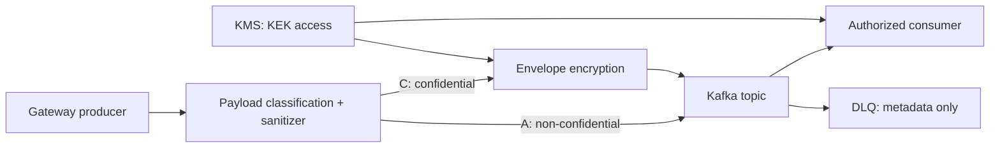

# T191 Kafka Gateway Confidentiality Boundary Decision Design

Created: 2026-07-11
PDCA Phase: Design
Slice: T191 Kafka Gateway Confidentiality Boundary Decision

## Architecture Decision

Status: Questions Open

현재 `KafkaGatewayEventBus`는 `GatewayBusEvent`를 JSON으로 직렬화해 `discord.gateway.events`에 저장하고, DLQ에는 원문 대신 size와 SHA-256 prefix만 남긴다. T191은 이 event의 실제 payload가 암호화 대상인지 먼저 결정한다.

### Competing branches

| Branch | 선택 조건 | 결과 |
| --- | --- | --- |
| A. 기존 구조 유지 | 모든 payload가 public/internal이며 계약·sanitizer·ACL로 충분 | crypto 코드는 추가하지 않고 payload 허용목록과 regression test만 후속으로 둔다. |
| B. 민감 event 분리 | 일부 event만 confidential | 별도 topic과 consumer 권한 경계를 정의한다. 필요할 때 그 topic에만 encryption을 적용한다. |
| C. Kafka 봉투 암호화 | broker/backup/운영자 평문 접근을 줄여야 하고, 허가된 consumer가 복호화해야 함 | value는 AES-GCM DEK로 암호화하고, DEK는 KMS에서 권한 관리되는 KEK로 감싼다. |

T191은 branch를 선택하는 문서 작업이다. branch C의 구현은 이 작업에서 금지한다.

## Required Decision Evidence

- producer caller → event type → payload field → data classification → topic/consumer/DLQ 노출 표
- Kafka ACL과 KMS 권한을 포함한 actor별 읽기/복호화 권한 표
- key, header, value, DLQ, log, backup에 대해 남는 메타데이터와 허용 여부
- branch C 선택 시 KMS 제공자, key owner, rotation SLO, incident revoke 절차의 운영 소유자

## Future Encryption Invariants

- AES-GCM nonce는 같은 DEK에서 절대 재사용하지 않는다.
- topic, key, encryption version, KEK ID는 AAD로 인증해 ciphertext/metadata 바꿔치기를 막는다.
- Kafka key와 header는 평문 메타데이터로 취급하고 PII를 두지 않는다.
- private KEK/DEK는 KMS 경계 밖의 config, log, DLQ, metric, test artifact에 저장하지 않는다.
- migration은 consumer plaintext fallback → producer canary → 관측 → rollback 순서로 진행한다.

## Boundary Flow

## Allowed Write Paths

- `docs/01-plan/features/T191-*`
- `docs/02-design/features/T191-*`
- `docs/03-analysis/T191-*`
- `docs/04-report/T191-*`
- `docs/05-feedback/T191-*`
- `docs/03-tasking/improvement-task-backlog.md`

## Forbidden Changes

- Do not modify unrelated product behavior.
- Do not introduce arbitrary command execution.
- Do not commit runtime artifacts or secrets.

## Agent Packet

~~~text
Task ID: T191
Goal: Kafka Gateway Confidentiality Boundary Decision
Required docs:
- docs/01-plan/features/T191-kafka-gateway-confidentiality-boundary-decision.plan.md
- docs/02-design/features/T191-kafka-gateway-confidentiality-boundary-decision.design.md
Allowed write paths:
- docs/**
Read-only context paths:
- docs/03-tasking/agent-team-operating-model.md
- qa/harness/README.md
Forbidden changes:
- No product or Kafka runtime changes
- No KMS/crypto dependency or secret configuration
Expected tests:
- rg-based producer/consumer inventory and existing focused Kafka gateway tests
Expected artifacts:
- docs/03-analysis/T191-kafka-gateway-confidentiality-boundary-decision.analysis.md
- docs/04-report/T191-kafka-gateway-confidentiality-boundary-decision.report.md
Return format:
- status
- changed files
- tests run and result
- residual risks
~~~

## Verification Commands

~~~bash
rg -n "GatewayBusPublishCommand|GatewayEventBus|KafkaGatewayEventBus" backend
./gradlew :backend:boot:test --tests com.example.discord.gateway.KafkaGatewayEventBusTest
~~~

## Risks

- Sanitizer is a credential-leak guard, not a durable data-classification system.
- Shared KEK reduces header growth but broadens the compromise blast radius; consumer-specific isolation requires a different cost/scale decision.
- 'CPU 1% increase' 같은 다른 서비스의 benchmark는 이 repository의 capacity evidence가 아니다.
