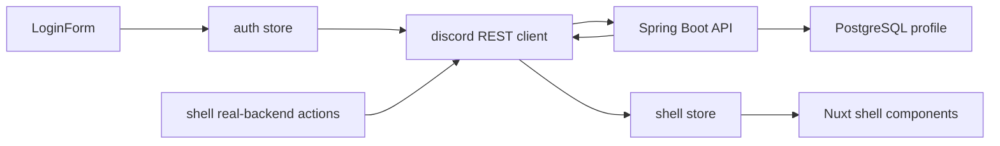

# T23 Frontend Real API Integration Stabilization Design

작성일: 2026-05-14  
PDCA Phase: Design  
Slice: T23 Frontend Real API Integration Stabilization

## Architecture Decision

Add real-backend flows beside the existing deterministic Pinia shell. The mock shell remains the fast component/e2e baseline, while T23 introduces explicit REST-backed actions and a dedicated Playwright real-backend spec.

## Runtime Configuration

Nuxt `runtimeConfig.public.apiBaseUrl` provides the REST base URL.

- Default: `http://127.0.0.1:8080`
- Override: `NUXT_PUBLIC_API_BASE_URL`

The REST client already supports `baseUrl`, bearer token, and `X-Request-Id`; T23 will wrap it in a composable or store helper to avoid duplicating client setup.

## Auth Token Policy

- Access token stays in Pinia memory only.
- No localStorage, sessionStorage, or cookie persistence.
- Login form calls backend `/api/auth/login`.
- Test fixtures may create users via backend API before UI login, but the UI must perform the login itself.

## Store Boundary

Auth store:

- owns `accessToken`, `user`, `error`, `isLoading`.
- maps `DiscordRestError` to user-safe messages.

Shell store:

- keeps seeded local state for mock tests.
- adds real-backend action group:
  - `createBackendGuild(name, token)`
  - `createBackendChannel(guildId, name, type, token)`
  - `sendBackendMessage(channelId, content, token)`
  - `joinBackendVoice(channelId, token)`
  - `startBackendStage(channelId, topic, token)`
- updates UI state from response objects only after API success.
- exposes `apiError` with `role="alert"` rendering in the shell.

## UI Data Flow

## Test Strategy

- Vitest:
  - auth store sends `/api/auth/login`, keeps token in memory, maps API errors.
  - shell real-backend actions only mutate state after successful response.
- Playwright local:
  - existing mock shell specs remain unchanged.
- Playwright real backend:
  - separate `real-backend.spec.ts`.
  - requires external backend at `REAL_BACKEND_BASE_URL` or default `http://127.0.0.1:8080`.
  - creates a unique user through API fixture, logs in through UI, then drives shell real-backend controls or store-exposed UI controls.

## Implementation Order

1. Add T23 plan/design docs and set PDCA state.
2. Add Nuxt runtime config and REST client factory helper.
3. Write failing auth store tests for real backend login and memory-only token policy.
4. Implement auth store/login UI update.
5. Write failing shell store tests for real-backed guild/channel/message/voice/stage actions.
6. Implement shell store actions and accessible API error rendering.
7. Add real-backend Playwright spec with explicit naming and environment guard.
8. Run frontend unit, build, local e2e, backend full, and real-backend e2e when backend is running.

## Risks

- Real-backend Playwright orchestration needs both Nuxt and Spring Boot running; keep it separate from local-only e2e.
- Current shell store is large; T23 should add narrow REST-backed action boundaries without broad refactoring.
- Backend stage/voice APIs are skeleton providers; T23 verifies request/response integration, not real media transport.
