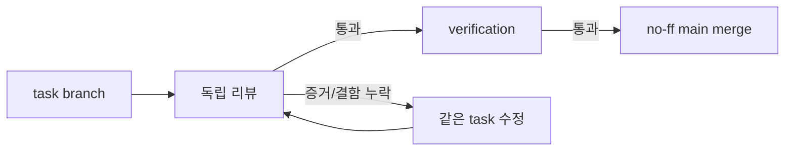

# T203 Git Task Workflow

## Approval Gate

- Status: Approved
- Approver: 사용자 지시(작업 브랜치·검수·merge correction loop)
- Blocking ambiguity: 없음
- Competing plan branches: 없음

## Goal

- 사용자/운영자 역량: 모든 작업을 `task_<id>-<slug>`에서 검수·검증한 뒤에만 `main`으로 병합하고, 검수 증거 자체가 부실하면 같은 task branch에서 수정 루프를 강제한다.
- Non-goals: Git hosting provider 설정, CI hook 도입, 기존 history 재작성.

## Domain Language

- Task branch: 기능 단위 변경과 증거를 격리하는 `task_<id>-<slug>` branch.
- Merge-review artifact: base/reviewed content/review/verification SHA와 병합 기준·독립 검수 결과를 기록하는 `docs/03-analysis/task_<id>-merge-review.md`.
- Review correction loop: review 부족을 발견하면 병합하지 않고 같은 task branch에서 수정 후 새 리뷰를 받는 절차.

## Participating Files

- `.agents/rules/git/task-branch-workflow.md`: branch·commit·push 경계.
- `.agents/rules/git/pre-merge-review.md`: 병합 전 증거와 correction loop.
- `.codex/skills/merging-feature-branches/SKILL.md`: 승인된 task branch의 merge·push·정리 절차.

## Expected Changed Files

- `.agents/rules/git/task-branch-workflow.md`: task branch·stage 범위·push 정책.
- `.agents/rules/git/pre-merge-review.md`: merge evidence와 correction loop 정책.
- `.codex/skills/merging-feature-branches/SKILL.md`: merge 실행 절차.
- `docs/02-design/task_T203-git-task-workflow-blueprint.md`: 승인된 T203 설계.
- `docs/03-analysis/task_T203-merge-review.md`: reviewed content 다음의 evidence artifact 단독 commit.

## Tier And Layer Responsibilities

- Infrastructure/runtime: Git branch와 remote 상태를 task 단위로 관리.
- QA/contracts: review score, finding, verification 증거를 병합 gate로 사용.

## System Flow Diagram

## Invariants And Boundaries

- `main`/`master`에는 직접 구현 commit/push하지 않는다.
- spec 및 quality/security review가 각각 90/100 미만이거나 P0/P1, verification 실패가 있으면 push/merge하지 않는다.
- 승인 예외는 feature branch push에만 적용하며 `main`/`master` merge·push에는 적용하지 않는다.
- 다른 task의 dirty file은 stage하지 않는다.

## Implementation Steps

1. 두 Git rule에 task branch와 독립 review correction loop를 명시한다.
2. merge skill에 artifact 독립 대조, no-ff merge, remote/local branch 삭제 순서를 명시한다.
3. reviewed content SHA·origin/main SHA를 대조하고, 현재 evidence artifact commit이 artifact만 변경했는지와 task branch가 최신 origin/main을 포함하는지 확인한다.
4. 항상 `git merge --no-ff`를 사용하고 remote 반영 SHA 확인 뒤에만 `git push origin --delete`와 `git branch -d` 순서로 branch를 삭제하도록 명시한다.
5. 문서 문법과 상호 참조, staged file 범위를 확인한다.

## Verification Gates

- `git diff --check`
- `rg`로 정확한 branch 패턴, 90/100, `P0/P1`, `correction loop`, 항상 `git merge --no-ff` 요구사항 확인
- 독립 spec review 및 quality/security review 각각 90/100 이상, P0/P1 없음

## Review Score Preset

- Preset: Implementation Review + Security Review
- Pass threshold: 각각 90/100, P0/P1 없음
