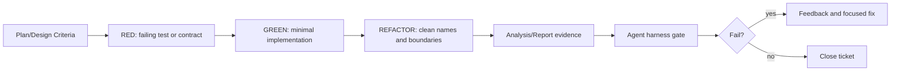
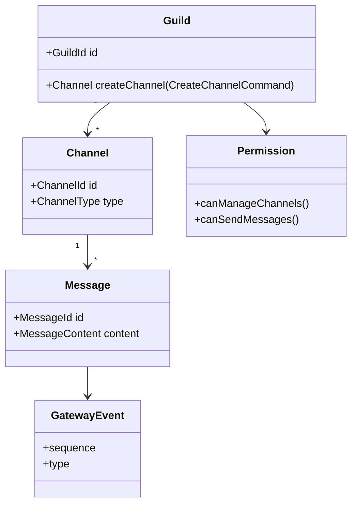
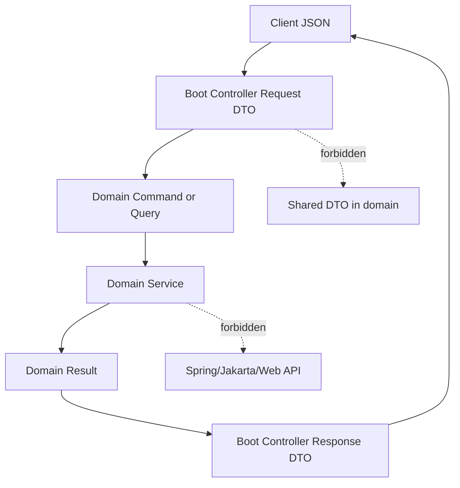
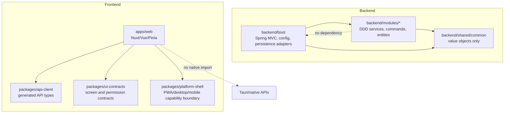

# Style Architecture Governance

작성일: 2026-05-20  
목적: 다음 에이전트와 개발자가 backend/frontend 코딩 스타일, TDD 증적, DDD 유비쿼터스 언어, DTO 경계, 메서드 시그니처 규칙을 같은 기준으로 판단하게 한다.

## Harness Gates

에이전트는 가능하면 직접 명령 대신 아래 Tool ID를 사용한다.

| Tool ID | Gate |
| --- | --- |
| `backend-style-contract` | Backend domain/runtime boundary, DTO suffix, method signature pressure. |
| `frontend-style-contract` | Web/native boundary, token storage, exported function signature pressure. |
| `development-process-contract` | TDD, DDD, DTO, method signature rules are documented and agent-visible. |
| `style-architecture-governance-contract` | This document and harness wiring exist. |

## TDD Evidence

새 기능과 버그 수정은 RED -> GREEN -> REFACTOR 순서로 진행한다.



증적 규칙:

- Analysis 또는 Report에 실행한 테스트 명령과 artifact 경로를 기록한다.
- 새 하네스/규칙은 먼저 실패하는 contract를 만들고 실패 원인을 확인한다.
- 기존 코드만 보고 과거 TDD 여부를 증명할 수 없으므로, 새 작업부터 RED/GREEN 증적을 남기는 방식으로 강제한다.

## Ubiquitous Language

Backend domain modules는 Discord 도메인 언어를 사용한다.



권장 이름:

- Domain intent: `CreateMessageCommand`, `EditMessageCommand`, `JoinVoiceChannelCommand`
- Domain result: `MessagePage`, `PermissionDecision`, `InviteAcceptance`
- Runtime DTO: boot/controller 내부의 `SignupRequest`, `MessageResponse`

피해야 할 이름:

- Domain module의 `*Dto`, `*Response`
- HTTP transport 의미가 domain으로 새는 `Http*`, `Json*`, `Controller*`
- 여러 레이어에서 같은 DTO를 공유하는 `Common*Dto`

## DTO Boundary

DTO는 레이어 경계에서 번역되어야 한다.



규칙:

- `backend/modules/**`와 `backend/shared/**`는 Spring/Jakarta/Web imports를 갖지 않는다.
- Domain module은 `*Dto`나 `*Response` 타입을 만들지 않는다.
- `*Request`가 domain에 필요하다면 진짜 도메인 용어인지 검토한다. 일반적으로 `*Command`, `*Query`, `*Intent`가 더 낫다.
- Frontend는 backend DTO shape를 화면 전체에 전파하지 말고 `services`나 shared contract에서 화면 모델로 변환한다.

## Method Signature

메서드 시그니처는 호출자가 의도를 읽을 수 있어야 한다.

```mermaid
flowchart LR
  Bad[createMessage(guildId, channelId, authorId, content, nonce, attachments)] --> Problem[Parameter order bugs]
  Problem --> Good[createMessage(CreateMessageCommand command)]
  Good --> Test[Focused test names]
```

규칙:

- 0-3개 파라미터는 보통 허용한다.
- 4개 파라미터는 확장 전 command/query/options object를 검토한다.
- 5개 초과 파라미터는 하네스 실패 대상이다.
- Boolean flag가 2개 이상이면 별도 command/value object로 분리한다.
- Frontend exported function은 여러 위치에서 쓰이므로 4개 초과 파라미터를 금지한다.

## Layer Boundary



## Current Observations

- 많은 테스트 파일이 존재하지만, 과거 작업이 TDD였는지는 코드 스냅샷만으로 확정할 수 없다.
- `backend/modules/channel`은 production module-local `src/test/java`가 없어 후속 보강 후보이다.
- 일부 domain 타입은 `*Request` suffix를 사용한다. 현재는 warning으로 취급하고, 새 작업에서는 `*Command`/`*Query`를 우선한다.
- Frontend security dashboard는 operator token을 `sessionStorage`에 저장하는 흐름이 있다. access/refresh token 저장 금지는 계속 강제한다.

## Agent Checklist

새 구현 전에:

- Plan/Design에서 유비쿼터스 언어를 확인한다.
- 새 public method/exported function의 파라미터 수와 command/options object 필요성을 검토한다.
- DTO가 controller/service/domain/store 경계를 넘어 전파되는지 확인한다.

새 구현 중:

- RED test 또는 contract를 먼저 만든다.
- GREEN 구현은 해당 테스트를 통과하는 최소 변경으로 제한한다.
- REFACTOR는 테스트가 통과한 뒤 이름과 경계를 정리한다.

완료 전:

- `qa/agent-harness.ps1 -Tool backend-style-contract`
- `qa/agent-harness.ps1 -Tool frontend-style-contract`
- `qa/agent-harness.ps1 -Tool development-process-contract`
- `qa/agent-harness.ps1 -Tool style-architecture-governance-contract`
