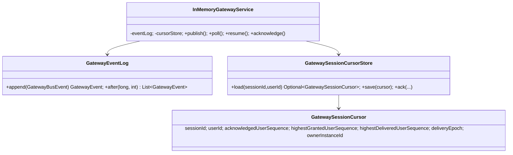

# T171-C3 Gateway Control Durable Event Log·Session Cursor 구현 계획

> **For agentic workers:** 이 계획의 각 단계를 순서대로 실행한다. 모든 동작 변경은 RED → GREEN → 리팩터링 순서를 지키고, 완료 전 독립 spec/quality/security review와 검증을 수행한다.

**Goal:** Gateway event와 session delivery cursor를 프로세스 메모리에서 분리해 PostgreSQL 재시작·다중 pod에서도 append, replay, ACK의 기준을 보존한다.

**Architecture:** Gateway Control이 immutable `event_id`와 전역 관찰용 `event_sequence`를 event log에 기록하고, 사용자별 `user_sequence` delivery row와 session cursor를 같은 저장소에서 관리한다. WebSocket transport는 이 계약을 호출하는 클라이언트일 뿐이며, 이번 범위에서는 기존 public HTTP/WebSocket 경로를 깨지 않도록 호환 API를 유지한다. C2가 `V16__authorization_projection_outbox.sql`을 소유하므로 Gateway schema는 `V17__gateway_control_durable_delivery.sql`로 추가한다.

**Tech Stack:** Java 21, Spring Boot 3.5.14, PostgreSQL/Flyway, JDBC, Testcontainers PostgreSQL, JUnit 5, AssertJ.

---

## 승인 게이트

- Status: Approved
- Blocking ambiguity: 없음. 이번 보강에서는 `gateway_session_delivery`의 cursor 값을 현재 public 호환 API의 `event_sequence`로 사용한다. 사용자별 `user_sequence` materialization과 grant 발급은 별도 C3.1 task로 분리하며, C3 완료 기준에 포함하지 않는다.
- Non-goals: Kafka producer/consumer 교체, gateway-service 분리, mTLS/Kubernetes manifest, Redis Stream 제거는 후속 task다.

## 고정 계약

1. `eventId`는 재시도에도 같은 UUID이고 `(event_id)` unique다. 같은 ID의 payload hash가 같으면 기존 row/sequence를 반환하고, hash가 다르면 `GatewayEventConflictException`으로 거부한다.
   payload hash identity에는 publish timestamp를 포함하지 않으며, Kafka transport는 bounded broker ACK 성공 후에만 local delivery를 알린다.
2. C3 현재 범위의 public HTTP/WebSocket cursor와 ACK는 durable `event_sequence`를 사용한다. `gateway_session_delivery` 컬럼명(`*_user_sequence`)은 C3.1 materialization 호환을 위해 유지하며, C3에서는 값이 event sequence와 동일하다. C3.1에서 사용자별 `gateway_user_delivery.user_sequence`를 도입할 때 API 버전을 올리고 이 매핑을 제거한다.
3. `gateway_session_delivery`의 불변식은 `0 <= acknowledged_user_sequence <= highest_delivered_user_sequence <= highest_granted_user_sequence`다. 모든 값은 C3에서 event sequence 단위다.
4. ACK가 현재 `highest_delivered_user_sequence`보다 크면 `GatewayAckOutOfRangeException`; 현재 값 이하의 중복 ACK는 성공 no-op이다.
5. retention보다 오래된 replay 요청은 `GatewayResyncRequiredException`이다. JDBC oldest sequence도 만료되지 않은 행만 기준으로 계산한다. visibility 재평가는 기존 `InMemoryGatewayService.canDeliver`를 재사용한다.
6. JDBC 테스트는 `DISCORD_RUN_POSTGRES_TESTS=true`에서만 Testcontainers PostgreSQL로 실행하며, 기본 test task는 Docker·외부 PostgreSQL을 요구하지 않는다.

## 변경 파일

- Create: `backend/modules/gateway/src/main/java/com/example/discord/gateway/GatewayEventLog.java`
- Create: `backend/modules/gateway/src/main/java/com/example/discord/gateway/InMemoryGatewayEventLog.java`
- Create: `backend/modules/gateway/src/main/java/com/example/discord/gateway/GatewaySessionCursor.java`
- Create: `backend/modules/gateway/src/main/java/com/example/discord/gateway/GatewaySessionCursorStore.java`
- Create: `backend/modules/gateway/src/main/java/com/example/discord/gateway/InMemoryGatewaySessionCursorStore.java`
- Create: `backend/modules/gateway/src/main/java/com/example/discord/gateway/GatewayAckOutOfRangeException.java`
- Create: `backend/modules/gateway/src/main/java/com/example/discord/gateway/GatewayResyncRequiredException.java`
- Modify: `backend/modules/gateway/src/main/java/com/example/discord/gateway/InMemoryGatewayService.java`
- Modify: `backend/boot/src/main/java/com/example/discord/gateway/GatewayConfiguration.java`
- Create: `backend/boot/src/main/java/com/example/discord/gateway/JdbcGatewayEventLog.java`
- Create: `backend/boot/src/main/java/com/example/discord/gateway/JdbcGatewaySessionCursorStore.java`
- Create: `backend/boot/src/main/resources/db/migration/V17__gateway_control_durable_delivery.sql`
- Modify: `backend/boot/src/test/java/com/example/discord/persistence/PersistenceBootstrapTest.java`
- Modify: `backend/modules/gateway/src/test/java/com/example/discord/gateway/InMemoryGatewayServiceTest.java`
- Create: `backend/boot/src/test/java/com/example/discord/gateway/JdbcGatewayEventLogTest.java`
- Create: `backend/boot/src/test/java/com/example/discord/gateway/JdbcGatewaySessionCursorStoreTest.java`
- Modify: `backend/boot/build.gradle.kts` (Testcontainers PostgreSQL/JUnit Jupiter test dependencies)
- Modify: `backend/boot/src/main/java/com/example/discord/auth/AuthConfiguration.java` (legacy-auth compatibility issuer)
- Modify: `backend/boot/src/main/java/com/example/discord/ops/ProductionSecretConfiguration.java` (production + legacy-auth issuer rejection)
- Modify: `backend/boot/src/main/java/com/example/discord/gateway/GatewayController.java` (durable ACK endpoint and eventId-aware publish)
- Modify: `backend/boot/src/main/java/com/example/discord/gateway/GatewayWebSocketHandler.java` (heartbeat ACK persistence and durable resume cursor)
- Modify: `backend/boot/src/main/java/com/example/discord/gateway/KafkaGatewayEventBus.java` (bounded broker ACK before local delivery)
- Modify: `backend/boot/src/test/java/com/example/discord/auth/AuthConfigurationTest.java`
- Modify: `backend/boot/src/test/resources/application.properties` and `application.yml` (test profile/key fixture)
- Modify: `backend/boot/src/main/java/com/example/discord/guild/GuildController.java`
- Modify: `backend/boot/src/main/java/com/example/discord/invite/InviteController.java`
- Modify: `backend/boot/src/main/java/com/example/discord/message/MessageController.java`
- Create: `docs/03-analysis/T171-C3-gateway-control-implementation-review.md`

## 자료 구조

## 구현 순서

### Task 1: 도메인 포트와 RED 테스트 ✅

- `GatewayEventLog`/`GatewaySessionCursorStore` 포트와 cursor 예외를 추가한다.
- 기존 `InMemoryGatewayServiceTest`에 다음 RED를 추가한다: durable append duplicate idempotency, ACK upper-bound rejection, stale duplicate no-op, resume epoch increment, retention resync.
- 실행: `./gradlew :backend:modules:gateway:test --tests com.example.discord.gateway.InMemoryGatewayServiceTest`.
- RED evidence: 구현 전 `GatewayAckOutOfRangeException`, `GatewaySessionCursor`, `acknowledge` 미존재 컴파일 실패를 확인했다.

### Task 2: 인메모리 GREEN 구현 ✅

- 기존 event list/dedup을 `InMemoryGatewayEventLog`로 이동한다.
- session별 cursor를 `InMemoryGatewaySessionCursorStore`에 저장하고 `InMemoryGatewayService`의 poll/resume/ack 흐름에서 단조성·epoch 검사를 적용한다.
- 기존 public 메서드(`poll(session,user,afterSequence)`, `resume(session,user,lastSequence)`)는 호환용으로 유지하되 새 cursor 경로를 사용한다.
- Task 1 focused test와 전체 `:backend:modules:gateway:test`를 통과시킨다.

### Task 3: PostgreSQL schema와 JDBC adapter ✅

- `V17`에 `gateway_event_log`, `gateway_user_delivery`, `gateway_session_delivery`, `gateway_delivery_grant` 및 user/event/session 인덱스를 추가한다.
- `JdbcGatewayEventLog`는 transaction 안에서 event ID/hash를 먼저 조회하고 신규일 때만 sequence를 발급한다.
- `JdbcGatewaySessionCursorStore`는 `SELECT ... FOR UPDATE`와 조건부 UPDATE로 ACK/CAS를 단조적으로 적용한다.
- PostgreSQL 테스트는 환경변수 gate 아래 Testcontainers의 ephemeral PostgreSQL에서 migration 존재, duplicate/hash conflict, ACK 범위 및 cursor CHECK를 검증한다.
- Spring `@Repository` 예외변환 프록시와 충돌하던 JDBC adapter의 `final` 선언을 제거했다.

### Task 4: Spring wiring와 문서화 ✅

- `postgres` profile에서는 JDBC event log/cursor store를 bean으로 선택하고 기본 profile은 인메모리 구현을 사용한다.
- 기존 Redis session registry는 호환 adapter로 남기되 durable cursor의 source of truth로 사용하지 않는다.
- 리뷰 문서에 blueprint alignment, verification, residual risk를 기록한다.

### Task 5: 검증에서 발견한 호환성 결함 수정 ✅

- test profile은 기존 레거시 컨트롤러 테스트를 위해 `test,legacy-auth`를 활성화하되 production 기본 profile은 변경하지 않는다.
- `legacy-auth`에서만 `private-key-location`이 설정된 Ed25519 `AccessTokenService`를 만들고 public key map으로 즉시 검증 가능하게 한다. production profile은 발급기 Bean을 만들지 않는다.
- `AuthenticatedUserResolver`가 만든 `ResponseStatusException`이 controller advice의 `IllegalArgumentException`에 의해 400으로 덮이지 않도록 Guild/Invite/Message advice에서 status를 먼저 보존한다.

## 검증 게이트

- RED 증거: Task 1 테스트가 구현 전 기대 동작 부재로 실패.
- GREEN: `./gradlew :backend:modules:gateway:test :backend:boot:test --tests com.example.discord.gateway.JdbcGatewayEventLogTest --tests com.example.discord.gateway.JdbcGatewaySessionCursorStoreTest`.
- 정적: `git diff --check`, `./gradlew :backend:modules:gateway:test`.
- 전체: `./gradlew test --no-daemon`, `./gradlew :backend:boot:check :backend:modules:gateway:check --no-daemon`.
- PostgreSQL opt-in: PowerShell에서 `$env:DISCORD_RUN_POSTGRES_TESTS='true'; ./gradlew :backend:boot:test --tests com.example.discord.gateway.JdbcGatewayEventLogTest --tests com.example.discord.gateway.JdbcGatewaySessionCursorStoreTest --no-daemon`.
- 완료 기준: spec/quality/security review 각각 90/100 이상, P0/P1 0, 선언한 검증 성공.

현재 구현은 T171-C3의 event log/session cursor 코어 범위다. C3는 public cursor를 event sequence로 고정하며 `gateway_user_delivery`의 사용자별 materialization과 one-time delivery grant 발급은 C3.1 후속 task에서 활성화한다. C3.1은 API 버전 변경과 별도 review를 요구한다.

## 잔여 위험

- Kafka 원본 event handoff와 gateway-service 분리는 T206/T207에서 별도로 구현한다.
- 현재 public controller의 `afterSeq`/`lastSeq`는 event sequence cursor로 유지한다. ACK는 HTTP `/sessions/{sessionId}/ack`와 WebSocket heartbeat 양쪽에서 동일 cursor store에 기록한다. transport 내부 API 전환 때 C3.1 user sequence로 교체한다.
- PostgreSQL 실측은 Docker/CI 환경에서만 수행되며 로컬 기본 테스트는 Docker·DB 없이 skip/pass해야 한다.
