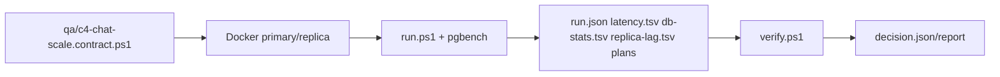

# T171-C4 채팅 중심 PostgreSQL 확장성 구현 계획

> **For agentic workers:** REQUIRED SUB-SKILL: Use `superpowers:subagent-driven-development` (recommended) or `superpowers:executing-plans` to implement this plan task-by-task. Steps use checkbox (`- [ ]`) syntax for tracking.

**Goal:** 단일 리전에서 채팅 쓰기·커서 조회·검색 부하를 동일 데이터셋으로 측정하고, `baseline`·`date_range`·`date_hash`와 read replica의 채택 여부를 재현 가능한 증거로 결정한다.

**Architecture:** C4는 운영 스키마를 변경하지 않는 격리된 PostgreSQL 16 primary/replica Docker harness다. PowerShell이 compose를 기동하고 `pgbench`를 실행하며, TSV/JSON 산출물을 기록하고 순수 검증기가 채택 기준을 판정한다. `chat_room_id`는 현재 `messages.channel_id`의 벤치마크 호환명이며, 애플리케이션 라우팅 코드는 이번 범위에 넣지 않는다.

**Tech Stack:** PostgreSQL 16, Docker Compose, `pgbench`, `psql`, PowerShell 7+, 기존 `qa/*.contract.ps1` 패턴.

---

## 승인된 블루프린트

- 상태: Approved (설계 문서 `docs/superpowers/specs/2026-08-13-t171-c4-chat-scale-design.md`, commit `00686c3`)
- 범위: 측정 harness·부하 시나리오·라우팅 계약·증거 검증
- 제외: 운영 `messages` 마이그레이션/백필, 실제 애플리케이션 datasource 전환, 다중 리전, 자동 shard cutover
- 동일 seed 계약: UTC 30일, 1,000,000행, 1,000 room, hot-room 1%가 쓰기 20%, 쓰기 50%/history 35%/search 15%, retry 1%
- 판정 기준: 오류율 1% 미만, cursor 중복·누락 0, UTC 경계·partition pruning 통과, replica lag p95 <2초



## 파일 경계

- 계약·라우팅: `qa/c4-chat-scale.contract.ps1`, `qa/c4-chat-scale/routing-policy.ps1`, `qa/c4-chat-scale/routing-policy.tests.ps1`
- 격리 DB: `qa/c4-chat-scale/docker-compose.yml`, `qa/c4-chat-scale/init/001-schema.sql`
- 부하: `qa/c4-chat-scale/pgbench/write.sql`, `qa/c4-chat-scale/pgbench/history.sql`, `qa/c4-chat-scale/pgbench/search.sql`
- 실행·증거: `qa/c4-chat-scale/run.ps1`, `qa/c4-chat-scale/verify.ps1`, `qa/c4-chat-scale/README.md`
- 산출물(커밋 금지): `qa/artifacts/c4-chat-scale/<run-id>/`

## Task 1: 라우팅 계약을 RED→GREEN으로 고정

**Files:**
- Create: `qa/c4-chat-scale/routing-policy.tests.ps1`
- Create: `qa/c4-chat-scale/routing-policy.ps1`
- Create: `qa/c4-chat-scale.contract.ps1` (이 작업에서는 라우팅 파일·함수 계약만 검사)

- [ ] **Step 1: 실패 테스트 작성**

`routing-policy.tests.ps1`는 아직 없는 `routing-policy.ps1`을 dot-source하고 아래 네 동작을 assert한다.

```powershell
$ErrorActionPreference = 'Stop'
. (Join-Path $PSScriptRoot 'routing-policy.ps1')
if ((Get-ShardId -ChatRoomId 'room-1' -EventDate ([datetime]'2026-01-02T00:00:00Z') -ShardCount 1) -ne 0) { throw 'initial shard must be 0' }
if ((Get-ShardId -ChatRoomId 'room-1' -EventDate ([datetime]'2026-01-02T00:00:00Z') -ShardCount 16) -notin 0..15) { throw 'shard must be within range' }
if ((Get-ShardId -ChatRoomId 'room-1' -EventDate ([datetime]'2026-01-02T00:00:00Z') -ShardCount 16) -ne (Get-ShardId -ChatRoomId 'room-1' -EventDate ([datetime]'2026-01-02T00:00:00Z') -ShardCount 16)) { throw 'routing must be deterministic' }
try { Get-ShardId -ChatRoomId '' -EventDate ([datetime]'2026-01-02T00:00:00Z') -ShardCount 16 | Out-Null; throw 'empty room accepted' } catch { if ($_.Exception.Message -eq 'empty room accepted') { throw } }
Write-Output 'C4_ROUTING_TEST_PASS'
```

- [ ] **Step 2: RED 확인**

실행: `pwsh -NoProfile -File qa/c4-chat-scale/routing-policy.tests.ps1`
기대: 파일 부재 오류로 실패한다. 이 실패가 확인되기 전에는 `routing-policy.ps1`을 만들지 않는다.

- [ ] **Step 3: 최소 구현**

`routing-policy.ps1`은 SHA-256의 첫 4바이트를 little-endian 정수로 읽어 `hash % ShardCount`를 반환한다. `ShardCount=1`은 항상 0이며, 빈 room·UTC가 아닌 날짜·0 이하 shard 수는 `ArgumentException`으로 거부한다. 이번 측정의 운영 초기값은 호출자가 `1`을 전달한다.

- [ ] **Step 4: GREEN 확인 및 계약 실행**

실행: `pwsh -NoProfile -File qa/c4-chat-scale/routing-policy.tests.ps1; pwsh -NoProfile -File qa/c4-chat-scale.contract.ps1`
기대: `C4_ROUTING_TEST_PASS`, `C4_CHAT_SCALE_CONTRACT_PASS`가 출력된다.

- [ ] **Step 5: 커밋**

```bash
git add qa/c4-chat-scale qa/c4-chat-scale.contract.ps1
git commit -m "test(T171-C4): lock chat shard routing contract"
```

## Task 2: primary/replica 격리 harness와 동일 스키마 구축

**Files:**
- Create: `qa/c4-chat-scale/docker-compose.yml`
- Create: `qa/c4-chat-scale/init/001-schema.sql`
- Create: `qa/c4-chat-scale/pgbench/write.sql`
- Create: `qa/c4-chat-scale/pgbench/history.sql`
- Create: `qa/c4-chat-scale/pgbench/search.sql`
- Modify: `qa/c4-chat-scale.contract.ps1` (compose·SQL 정적 계약 추가)

- [ ] **Step 1: RED 계약 추가 후 실행**

계약은 compose에 `primary`, `replica`, `pgbench` 서비스, host port `15442/15443`, `wal_level=replica`, replication slot, `pg_wal_replay_pause`, SQL의 `baseline/date_range/date_hash` 세 변형과 `UNIQUE(chat_room_id, sequence)`를 요구한다. 실행: `pwsh -NoProfile -File qa/c4-chat-scale.contract.ps1`. 기대: 없는 compose 파일명 오류로 실패한다.

- [ ] **Step 2: 최소 Docker 구성 작성**

`primary`는 `postgres:16-alpine`, `POSTGRES_DB=c4chat`, `POSTGRES_USER=c4_user`, 로컬 전용 포트 `15442:5432`를 사용한다. `replica`는 별도 named volume, `primary_conninfo`, replication slot을 사용하고 외부 포트 `15443:5432`를 노출한다. 비밀번호는 compose 기본값에만 두고 실행 산출물에 기록하지 않는다. `pgbench` 서비스는 실행 시 `profiles: [load]`로만 기동한다.

- [ ] **Step 3: 스키마·부하 SQL 작성**

`001-schema.sql`은 다음 테이블을 만든다.

```sql
CREATE TABLE messages_baseline (LIKE messages_template INCLUDING ALL);
CREATE TABLE messages_date_range (LIKE messages_template INCLUDING ALL);
CREATE TABLE messages_date_hash (LIKE messages_template INCLUDING ALL);
```

실제 구현에서는 `messages_template`을 먼저 `chat_room_id text`, `event_date date`, `sequence bigint`, `content text`, `idempotency_key text`, `created_at timestamptz`로 만들고, `messages_date_range`는 `PARTITION BY RANGE (event_date)`, 자식 일자 파티션은 30개, `messages_date_hash`는 같은 RANGE 부모 아래 `PARTITION BY HASH (chat_room_id)` 16개로 만든다. `write.sql`은 `ON CONFLICT (chat_room_id, sequence) DO NOTHING`, `history.sql`은 `(chat_room_id, sequence) > (:cursor)` 정렬 커서, `search.sql`은 room·일자 범위 조건을 사용한다.

- [ ] **Step 4: GREEN 정적 계약 확인**

실행: `pwsh -NoProfile -File qa/c4-chat-scale.contract.ps1`. 기대: `C4_CHAT_SCALE_CONTRACT_PASS`. Docker가 실행 중이면 `docker compose -f qa/c4-chat-scale/docker-compose.yml config`도 통과해야 한다.

- [ ] **Step 5: 커밋**

```bash
git add qa/c4-chat-scale qa/c4-chat-scale.contract.ps1
git commit -m "test(T171-C4): add isolated postgres primary replica harness"
```

## Task 3: 동일 seed 부하 실행과 증거 기록

**Files:**
- Create: `qa/c4-chat-scale/run.ps1`
- Modify: `qa/c4-chat-scale.contract.ps1` (실행 인자·비밀 누출·산출물 계약 추가)
- Modify: `qa/c4-chat-scale/README.md`

- [ ] **Step 1: RED 실행 계약 작성**

계약은 `run.ps1`에 `-Variant baseline|date_range|date_hash|all`, `-DurationMinutes`(기본 40, 1 이상), `-Seed`(기본 1714), `-ArtifactRoot`를 요구하고 `-ArtifactRoot` 외부에 파일을 쓰지 않는지 문자열로 검사한다. 실행: `pwsh -NoProfile -File qa/c4-chat-scale.contract.ps1`. 기대: `run.ps1` 부재 오류로 실패한다.

- [ ] **Step 2: 최소 실행기 구현**

`run.ps1`은 다음 순서만 수행한다.

1. `run-id = UTC yyyyMMdd-HHmmss-fff` 디렉터리를 만들고 `run.json`에 variant·seed·duration·UTC·git SHA만 기록한다.
2. `docker compose up -d primary replica` 후 `pg_isready`를 polling한다. timeout은 120초이며 실패 시 compose 로그를 artifact에 남기고 non-zero 종료한다.
3. 각 variant에 대해 template seed를 primary에 한 번 적재하고 `pgbench`를 4 phase(300/900/900/300초)로 실행한다. 각 phase 총 시간은 유지하되 write/history/search를 각각 50%/35%/15% 시간 창으로 순차 실행해 operation 합계가 phase 시간을 넘지 않게 한다. 모든 phase에서 `-j 4 -c 16`을 고정하고 `--aggregate-interval=10`으로 `latency.tsv`를 만든다. 따라서 `all + 40분`은 variant당 40분, 전체 약 120분이다.
4. 매 10초 `pg_stat_replication`, `pg_stat_user_tables`와 `pg_total_relation_size`·`pg_indexes_size`, `EXPLAIN (ANALYZE, BUFFERS, FORMAT TEXT)` 결과를 각각 `replica-lag.tsv`, `db-stats.tsv`, `plans/<variant>-<operation>.txt`에 append한다. `db-stats.tsv`의 relation/index size는 50GB 이하, vacuum_count 비감소, live>0일 때 dead/live 10% 이하를 검증기가 모두 확인하며 누락·파싱 실패는 fail-closed 한다.
5. 모든 variant 부하가 끝나면 replica에서 `pg_wal_replay_pause()`를 호출하고 primary에 lag payload를 기록한 뒤 `routing.tsv`에 healthy history→replica, lag >2초→primary fallback, lag >30초→primary 제한 warning, write/read-after-write→primary·stale 0을 기록한다. 마지막에 `pg_wal_replay_resume()`을 `finally`로 보장한다.
6. `run.json`에 secret/password/DSN을 쓰지 않고, 종료 시 `docker compose down -v`를 보장한다.

- [ ] **Step 3: RED→GREEN 실행 검증**

RED: `pwsh -NoProfile -File qa/c4-chat-scale/run.ps1 -Variant invalid`가 parameter validation 오류를 내야 한다.
GREEN: `pwsh -NoProfile -File qa/c4-chat-scale/run.ps1 -Variant baseline -DurationMinutes 1` 실행 후 artifact 아래 `run.json`, `latency.tsv`, `db-stats.tsv`, `replica-lag.tsv`, `plans/`가 존재해야 한다. 네트워크가 차단되면 Docker health check 결과만 기록하고 실패 원인을 출력한다.

- [ ] **Step 4: README에 재현 명령 고정**

README에는 다음 명령과 포트, 기본 seed, 40분 비용, 산출물 금지 규칙을 한국어로 기록한다.

```powershell
pwsh -NoProfile -File qa/c4-chat-scale.contract.ps1
pwsh -NoProfile -File qa/c4-chat-scale/run.ps1 -Variant all -DurationMinutes 40
pwsh -NoProfile -File qa/c4-chat-scale/verify.ps1 -ArtifactDir qa/artifacts/c4-chat-scale/<run-id>
```

- [ ] **Step 5: 커밋**

```bash
git add qa/c4-chat-scale qa/c4-chat-scale.contract.ps1
git commit -m "feat(T171-C4): run chat scale variants and capture evidence"
```

## Task 4: 증거 검증·판정 보고서와 최종 게이트

**Files:**
- Create: `qa/c4-chat-scale/verify.ps1`
- Modify: `qa/c4-chat-scale.contract.ps1` (검증기 계약 추가)
- Create: `docs/04-report/t171-c4-chat-scale-verification.md`

- [ ] **Step 1: RED verifier 테스트 추가**

계약 테스트는 임시 artifact fixture를 만들고, `latency.tsv`의 p99가 500ms를 넘거나 `error_rate`가 0.01 이상이면 `verify.ps1`가 non-zero와 `decision=REJECT`를 반환하는지 확인한다. cursor 중복·누락, `pruning=false`, lag p95≥2s도 동일하게 거부해야 한다. 실행 전 `verify.ps1` 부재 오류를 확인한다.

- [ ] **Step 2: 최소 검증기 구현**

`verify.ps1`은 입력 경로가 `qa/artifacts/c4-chat-scale` 아래인지 확인하고, 필수 파일·TSV 헤더·숫자 범위를 검사한다. 다음 JSON을 항상 쓴다.

```json
{"decision":"ACCEPT|REJECT","variant":"baseline|date_range|date_hash","p99_ms":0,"error_rate":0,"cursor_gap_count":0,"replica_lag_p95_ms":0,"pruning_pass":true,"reasons":[]}
```

판정은 설계 문서의 기준을 그대로 계산한다. `date_range`가 baseline 대비 p99를 안정화하고 오류율 <1%이면 후보, `date_hash`는 hot-room p99가 date_range보다 20% 이상 개선되고 오류·lag 회귀가 10% 이내일 때만 후보다. replica는 lag p95<2초이며 history/search p99가 primary 대비 20% 이내이고 fallback 관측 100%일 때만 승인한다. JSON 파싱 실패·누락은 fail-closed다.

- [ ] **Step 3: 보고서 생성**

`docs/04-report/t171-c4-chat-scale-verification.md`는 실행 SHA·명령·환경·variant별 표·결정·routing drill 표·미실행 항목·다음 단계(운영 마이그레이션 별도)를 한국어로 기록한다. 실측값 없이 성공을 주장하지 않고 `NOT_RUN`을 사용한다.

- [ ] **Step 4: GREEN 검증**

실행:

```powershell
pwsh -NoProfile -File qa/c4-chat-scale.contract.ps1
pwsh -NoProfile -File qa/c4-chat-scale/verify.ps1 -ArtifactDir qa/artifacts/c4-chat-scale/<fixture>
git diff --check
```

기대: 계약 통과, fixture의 허용·거부 판정 모두 통과, whitespace 오류 없음. Docker 실측을 수행한 경우 동일 명령으로 실제 artifact를 재검증한다.

- [ ] **Step 5: 커밋**

```bash
git add qa/c4-chat-scale qa/c4-chat-scale.contract.ps1 docs/04-report/t171-c4-chat-scale-verification.md
git commit -m "test(T171-C4): verify chat scale evidence and decision gates"
```

## 최종 검토·검증 게이트

- 각 Task마다 구현자 self-review → 독립 spec reviewer → 독립 quality reviewer 순서로 수행한다. 어느 단계든 P0/P1 또는 90점 미만이면 다음 Task로 이동하지 않고 수정 후 재검토한다.
- 최종 명령: `pwsh -NoProfile -File qa/c4-chat-scale.contract.ps1`, `docker compose -f qa/c4-chat-scale/docker-compose.yml config`, fixture verifier, 가능한 경우 `run.ps1 -Variant all -DurationMinutes 40`, `git diff --check`.
- Docker 미실행 또는 40분 실측 미완료는 구현 실패가 아니라 `NOT_RUN` 증거로 남기되, 운영 shard 채택 결론은 내리지 않는다.
- 산출물 디렉터리와 비밀은 커밋하지 않는다. 브랜치 `task_T171-C4-chat-scale`에서만 커밋하며, 최종 독립 리뷰가 90점 이상이고 P0/P1=0일 때에만 push/PR/merge 검토를 요청한다.

## 실행 완료 기록(2026-08-14)

- 정적 계약: `pwsh -NoProfile -File qa/c4-chat-scale.contract.ps1` → `C4_CHAT_SCALE_CONTRACT_PASS`.
- 최종 실측: `qa/artifacts/c4-chat-scale/20260813-165819-087`, `all + 40분`, 3 variant × 4 phase × 3 operation = 36행, plan 9개, cursor gap 0, replica lag p95 9.245ms, db-stats 474개 샘플.
- 실제 검증: `pwsh -NoProfile -File qa/c4-chat-scale/verify.ps1 -ArtifactDir qa/artifacts/c4-chat-scale/20260813-165819-087` → `C4_CHAT_SCALE_VERIFY_PASS`, `decision=ACCEPT`, `candidate_decision=DEFER`, `selected_variant=baseline`.
- 독립 리뷰: reviewed revision `4767d6f`, 9.5/10, P0=0/P1=0, 승인 가능. 잔여 P2는 실행기가 생성하는 table 값 allowlist 검증이며 운영 채택을 막지 않는다.
