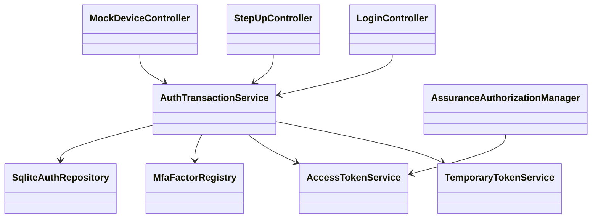
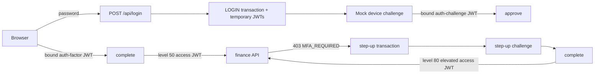

# Spring Security 7 JWT 로그인·MFA Challenge 리팩터링 청사진

## Approval Gate

- Status: Approved (Branch A)
- Approver: 사용자 (2026-09-05)
- 기준 revision: `task_MFA-mfa-spring-security7` working tree (2026-09-05 확인)
- Blocking ambiguity: 없음. refresh/cookie는 후속 작업으로 명시적으로 제외한다.
- Competing plan branches:
  - A (권장): 독립 MVP 계약을 유지한다. UUID `UserProfile`은 MFA SQLite account의 subject로만 사용하고, refresh·cookie는 이번 범위에서 제외한다.
  - B: refresh까지 검증한다. `backend/modules/identity`에 claim/refresh-store port를 추가하는 별도 승인 task를 선행한다.

## Goal

- 단일 `MfaApplication.java` MVP를 현재 동작을 보존하는 최소 계층으로 분리하고, JWT 로그인·MFA challenge·step-up 경계를 회귀 테스트로 고정한다.
- `access` JWT만 bearer resource server가 수용하며, 임시 capability JWT는 정확히 결속된 transaction/challenge에서만 사용되게 한다.

## Non-goals

- 실제 push/OTT/WebAuthn provider, enrollment, device 관리, rate limit, audit store, key rotation.
- root Gradle settings 또는 Discord production runtime 동작 변경.
- refresh cookie/rotation은 Branch A에서 구현하지 않는다.
- 브라우저 화면·Nuxt UI는 추가하지 않는다. 이 예제의 UI 범위는 HTTP JSON/curl walkthrough뿐이다.

## Domain Language

| Term | Meaning | Current code |
|---|---|---|
| access JWT | `typ=access` bearer resource credential | `JwtTokenService.issueAccess` |
| auth-factor JWT | 하나의 MFA transaction 완료 capability | `JwtTokenService.issueAuthFactor` |
| auth-challenge JWT | 하나의 mock challenge 승인 capability | `JwtTokenService.issueAuthChallenge` |
| assurance level | 설정된 완료 factor level의 최댓값 | `AuthService.complete` |
| MFA transaction | LOGIN 또는 STEP_UP factor 완료 상태 | `AuthTransaction` / SQLite |

## Participating Code And Write Paths

| Tier | Path | Planned change | Confidence |
|---|---|---|---|
| Build | `examples/mfa-spring-security7/settings.gradle.kts`, `build.gradle.kts` | 현재 `:discord-user`, `:discord-identity` dependency를 유지한다. Branch A에서는 identity API 확장을 하지 않는다. | High |
| Backend/application | `examples/mfa-spring-security7/src/main/java/com/example/mfa/{domain,application,adapter,security,web}/**` | 현재 `MfaApplication.java`의 records/services/repository/controllers를 책임별 파일로 이동한다. public HTTP 계약과 SQLite schema 의미는 보존한다. | High |
| Backend/config | `examples/mfa-spring-security7/src/main/resources/application.yml`, `schema.sql` | UUID subject를 선택한 경우에만 `users.id`/transaction user reference를 UUID로 이행한다. refresh branch는 별도 승인 전 금지한다. | Medium |
| UI/API surface | `examples/mfa-spring-security7/README.md` | curl JSON flow, temporary-token header, mock-device 한계를 실제 응답 계약과 일치시킨다. 브라우저 UI 파일은 없다. | High |
| Tests | `examples/mfa-spring-security7/src/test/java/com/example/mfa/{domain,security,adapter,web}/**` | 아래 acceptance/security-negative regression을 focused tests와 MockMvc flow로 분리한다. | High |
| Docs | `docs/superpowers/specs/2026-09-04-mfa-module-tdd-design.md`, `docs/superpowers/plans/2026-09-05-spring-security7-mfa-module-tdd.md` | 선택한 branch와 구현하지 않는 refresh 범위를 동기화한다. 이 문서는 기존 dirty 문서이므로 구현 task에서 소유권을 확인한 뒤에만 수정한다. | High |

## Tier And Layer Responsibilities

- web: `@Valid` request DTO, HTTP/header extraction, status mapping만 담당한다.
- application: password 검증 뒤 transaction 시작, factor 완료 판단, one-time completion, JWT 발급을 담당한다.
- domain: factor ID/level, transaction purpose·expiry·완료 불변식을 보유한다.
- adapter: SQLite account/transaction/challenge conditional update와 mock push `PENDING -> APPROVED`만 담당한다.
- security: token type/issuer/expiry/binding 검증, access JWT converter, finance `AuthorizationManager`를 담당한다.
- UI: 별도 browser UI 없음; README curl은 사용자 조작 설명일 뿐 인증 경계가 아니다.

## Structure Diagram

## Behavior Flow

## Invariants And Threat Boundaries

- `typ=access` 외 JWT는 bearer authentication이 될 수 없다; malformed, expired, issuer-invalid token은 `401`이다.
- auth-factor JWT는 `sub`, `purpose`, `transaction_id`가 모두 일치할 때만 complete를 허용한다.
- auth-challenge JWT는 추가로 `challenge_id`, `factor_id`가 일치할 때만 approve를 허용한다.
- transaction/challenge conditional update는 한 번만 성공한다. 만료·소비·다른 user binding은 `410` 또는 `401`이며 access JWT를 발급하지 않는다.
- factor level은 server configuration만 소유한다. request, adapter payload, access JWT claim이 level을 승격할 수 없다.
- raw password, access/temporary JWT, password hash, adapter state는 response 오류나 로그에 넣지 않는다.
- mock-device approve는 possession proof가 아닌 demo-only trust boundary다; real provider 전환 시 signed callback/WebAuthn assertion이 필요하다.

## Implementation Steps

1. 기존 MockMvc 흐름을 보존 regression으로 먼저 확장한다: password-only, wrong token type/binding, replay/expiry, finance denial/allow.
2. `UserProfile.id()` UUID를 SQLite account와 JWT `sub`의 단일 원본으로 이행하고, email lookup은 credential lookup에만 남긴다.
3. 책임 분리는 동작 회귀가 green인 뒤에 필요한 파일만 대상으로 한다. 단일 demo file의 기계적 분할은 별도 기능을 만들지 않으므로 이번 첫 vertical slice의 완료 조건이 아니다.
4. README를 구현된 API/토큰 한계에 맞게 갱신하고 smoke flow를 실행한다.

## Acceptance Criteria

1. password만으로 access JWT(및 Branch B가 아니면 refresh cookie)를 발급하지 않는다.
2. 로그인 push 승인과 bound auth-factor JWT 완료 뒤에만 level 50 `access` JWT를 발급한다.
3. level 50 또는 필요한 `amr`이 없는 level 80 token은 finance에서 `403 MFA_REQUIRED`; 승인된 step-up level 80 token은 `200`이다.
4. access/auth-factor/auth-challenge token type 혼동, 다른 user/transaction/challenge binding, expiry, replay가 access 발급 또는 protected API access로 이어지지 않는다.
5. `UserProfile.id()`를 채택하면 모든 JWT `sub`와 SQLite account/transaction foreign reference가 같은 UUID다.
6. refactor 후 `MfaApplication.java`는 composition/wiring만 보유하며 package split은 새 abstraction이나 duplicate SPI를 만들지 않는다.

## Verification Gates

- Environment: `cd examples/mfa-spring-security7 && ./gradlew --version` (현재 Gradle 8.14.4 / Java 21.0.7 확인).
- TDD: 각 behavior 변경은 focused JUnit RED(기대 failure) 후 GREEN.
- Focused: `cd examples/mfa-spring-security7 && ./gradlew test --tests com.example.mfa.web.MfaFlowIntegrationTest` 및 새 domain/security/adapter test.
- Full: `cd examples/mfa-spring-security7 && ./gradlew test`.
- Runtime: `cd examples/mfa-spring-security7 && ./gradlew bootRun`, README curl의 login -> approve -> complete -> finance denial -> step-up -> finance allow.
- Hygiene: `git diff --check` 및 task-owned path diff 검토. Branch B는 identity module focused tests와 separate security review를 추가한다.

## Plan Review (Preset: Plan Review)

| Category | Score | Evidence |
|---|---:|---|
| Scope clarity | 20/20 | goal, non-goals, acceptance criteria fixed |
| Architecture fit | 18/20 | current MVP flow verified; refresh dependency conflict remains |
| File impact | 15/15 | backend/UI/test/docs paths identified |
| Ambiguity control | 10/15 | refresh branch requires user choice |
| Verification plan | 20/20 | wrapper, focused/full/runtime/security-negative gates specified |
| Risk handling | 10/10 | token, replay, binding, mock-device boundaries explicit |
| Total | 93/100 | Branch A 승인으로 blocking ambiguity 해소 |

## Required Decision

Branch A가 승인되었다. refresh/identity 확장은 이 MVP의 후속 작업이다.

## Local WebAuthn Runtime Addendum

- Status: Approved. 사용자는 localhost-only passkey와 access-token step-up을 승인했고, refresh 및 외부 provider는 후속으로 남겼다.
- Goal: `rpId=localhost`는 유지하되, `allowedOrigin`과 RP 표시명은 환경 설정으로 바꿔 다른 로컬 포트에서도 동일한 origin 검증을 수행한다.
- Non-goals: production origin, provider credential, SMS/email/Kakao 호출, refresh 구현.
- Paths: `application.yml`, `MfaApplication.AuthProperties`, `securityFilterChain`, README, MockMvc runtime-property test.
- Invariants: 기본 origin은 `http://localhost:8080`; override도 localhost origin만 허용한다. CSRF는 WebAuthn/form endpoint에서 계속 필요하고 `/api/**`만 예외다.
- Verification: 기본 설정의 passkey option/login UI 회귀, `MFA_WEBAUTHN_ALLOWED_ORIGIN=http://localhost:8081`로 실행한 browser/HTTP smoke, 전체 `:test`.

## Local TOTP Addendum

- Status: Approved. 사용자는 local-only factor 구현을 승인했고, 외부 SMS/email/Kakao provider는 제외했다.
- Goal: Java 표준 crypto로 RFC 6238 6자리 TOTP를 검증하는 `totp` factor를 추가하고, 같은 user/time-step의 재사용을 local runtime에서 막는다.
- Non-goals: per-user enrollment/secret persistence, provider dispatch/callback, production secret management. local demo secret은 설정값으로만 제공한다.
- Paths: `application.yml`, `MfaApplication.AuthProperties`, `MfaFactorAdapter`, `AuthService`, new `TotpFactorAdapter`, `MfaFlowIntegrationTest`, README.
- Invariants: code는 30초 step과 ±1 drift만 허용한다; evidence의 code 이외 값은 권한 상승에 사용하지 않는다; 동일 user의 이미 사용한 step은 거부한다; factor level은 server config만 소유한다.
- Verification: RFC 6238 known-vector unit test, same-step replay denial, transaction completion의 `amr=[totp]`, 전체 `:test`.
