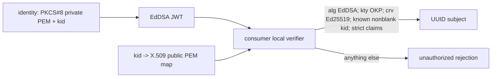

# Runtime Split 02: Ed25519 Bearer Verification

## Approval Gate

- Status: Approved
- Approver: user
- Decision: access JWT는 JOSE `alg=EdDSA` (Ed25519)만 허용한다.
- Blocking ambiguity: 없음. `issuer=discord-identity`, `audience=discord-api`, access-token TTL=1시간, clock skew=0초.
- Superseded decision: 2026-07-14 RS256 계획과 HS256 shared-secret 계획은 이 문서로 완전히 대체된다.

## Goal

- `identity-service`만 Ed25519 PKCS#8 private-key PEM으로 access JWT를 발급한다.
- message/websocket/community는 property-bound `kid -> X.509 public-key PEM` map으로 local verification만 한다.

## Non-goals

- RS256/HS256 fallback, remote JWKS fetch, JWK endpoint, 자동 key rotation, Gateway/OpenAPI/refresh-cookie/account-store 변경.

## Changed-Language Impact

- 기존 `RS256`, `RSA private/public PEM`, `alg=RS256` 언어는 각각 `Ed25519`, `PKCS#8 private PEM`/`X.509 public PEM`, `alg=EdDSA`로 교체한다.
- RSA `kid -> public key` map의 boundary는 유지하지만, 허용 JWK 의미는 `kty=OKP`, `crv=Ed25519`으로 제한한다.
- 기존 RS review의 P1: algorithm confusion 차단, P2: key material/token logging 금지는 같은 보안 invariant이므로 유지한다. RS key-format/RS256 compatibility 관련 항목은 superseded다.

## Domain Language

- issuer: `discord-identity`.
- audience: `discord-api`.
- kid: nonblank signing-key identifier. 누락·blank·unknown이면 거부한다.
- Ed25519 JWK: `kty=OKP`, `crv=Ed25519`; 다른 JWK type/curve는 거부한다.
- public-key map: property가 가리키는 `kid -> X.509 PEM` key locations.

## Participating Code

| Path | Responsibility |
| --- | --- |
| `backend/modules/identity/.../AccessTokenService.java` | JJWT와 Java 21 JCA EdDSA로 EdDSA issue/verify를 제공한다. |
| `backend/modules/identity/.../BearerTokenVerifier.java` | Bearer header 분리와 local verification 위임을 수행한다. |
| `backend/modules/identity/build.gradle.kts` | vetted JOSE dependency를 선언한다. |
| `backend/services/identity/.../IdentityServiceApplication.java` | issuer/audience/key-id/private PEM location과 self-verification public-key map을 binding한다. |
| non-identity `*Application.java` | issuer/audience/public-key map locations을 binding한다. |

## Expected Changed Files

- `backend/modules/identity/build.gradle.kts` — `io.jsonwebtoken:jjwt-api:<version>`을 implementation, `io.jsonwebtoken:jjwt-impl:<version>`과 `io.jsonwebtoken:jjwt-jackson:<version>`을 runtimeOnly로 추가한다. 세 artifact는 동일한 pinned current-stable version을 사용한다. Candidate: `0.12.6`; implementer는 resolve된 exact version을 보고한다. 새 `spring-security-oauth2-jose` dependency가 남아 있고 이 slice에서 사용되지 않으면 제거한다.
- `backend/modules/identity/src/main/java/com/example/discord/identity/AccessTokenService.java` — 수동 HS256 parser/signer를 library-based EdDSA issuer/verifier로 교체한다.
- `backend/modules/identity/src/main/java/com/example/discord/identity/BearerTokenVerifier.java` — shared-secret 생성자를 public-key map 기반으로 교체한다.
- `backend/modules/identity/src/test/java/com/example/discord/identity/AccessTokenServiceTest.java` — EdDSA/claims/header rejection contract를 test-first로 고정한다.
- `backend/modules/identity/src/test/java/com/example/discord/identity/BearerTokenVerifierTest.java` — Bearer/header/local verifier rejection contract를 추가한다.
- `backend/services/identity/src/main/java/com/example/discord/identityservice/IdentityServiceApplication.java` — property-bound issuer/audience/key-id/private PEM location 및 self-verification public-key map binding과 fail-fast validation을 추가한다.
- `backend/services/identity/src/test/java/com/example/discord/identityservice/IdentityServiceApplicationTest.java` — identity wiring/invalid configuration 및 self-issued token profile verification test를 갱신한다.
- `backend/services/message/src/main/java/com/example/discord/messageservice/MessageServiceApplication.java` — public-key map location binding과 fail-fast validation을 추가한다.
- `backend/services/message/src/test/java/com/example/discord/messageservice/BearerTokenVerifierTest.java` — consumer local verification test를 갱신한다.
- `backend/services/websocket/src/main/java/com/example/discord/websocketservice/WebsocketServiceApplication.java` — public-key map location binding과 fail-fast validation을 추가한다.
- `backend/services/websocket/src/test/java/com/example/discord/websocketservice/BearerTokenVerifierTest.java` — consumer local verification test를 갱신한다.
- `backend/services/community/src/main/java/com/example/discord/communityservice/CommunityServiceApplication.java` — public-key map location binding과 fail-fast validation을 추가한다.
- `backend/services/community/src/test/java/com/example/discord/communityservice/BearerTokenVerifierTest.java` — consumer local verification test를 갱신한다.

## Tier And Layer Responsibilities

- API/controller: `Authorization`을 전달만 하며 raw header/token을 로그하지 않는다.
- Shared identity module: JJWT와 Java 21 JCA EdDSA로 issue/verify와 claims validation을 소유하며 Spring/HTTP에 의존하지 않는다.
- Identity runtime: deployment secret에서 PKCS#8 Ed25519 private PEM과 같은 `kid`의 X.509 public PEM map을 읽는다. public map은 self-issued token의 profile verification에만 사용하며 private PEM은 identity 밖으로 나가지 않는다.
- Non-identity runtime: deployment secret/config에서 X.509 Ed25519 public PEM location map만 읽는다.
- Runtime config: `discord.auth.jwt.issuer`, `discord.auth.jwt.audience`, `discord.auth.jwt.key-id`, `discord.auth.jwt.private-key-location`, `discord.auth.jwt.public-key-locations.<kid>`를 property-bind하며 blank/invalid 값은 startup에서 실패시킨다. identity의 active `key-id`는 its public-key map에 반드시 존재해야 한다.

## Behavior Flow



## Invariants And Boundaries

- JOSE header accepts only `alg=EdDSA`; `none`, HS*, RS*, ES*, omitted, and malformed algorithms are rejected.
- Parsed key/JWK semantics must be `kty=OKP`, `crv=Ed25519` only.
- `kid`, `iss`, `aud`, `sub`, `iat`, `exp` are required. `sub` is a UUID; `exp > now`; zero clock skew applies.
- Missing/blank/unknown `kid`, invalid signature, malformed token, malformed PEM, blank property, missing key location, or invalid configuration fail safely without revealing key-map detail.
- No raw JWT, Authorization header, PEM/key value, or decoded header is logged.
- No remote JWKS/JWK endpoint/automated rotation exists in this slice. No algorithm fallback exists.
- Java 21의 JCA EdDSA를 사용한다. BouncyCastle, `net.i2p.crypto.eddsa`, 또는 다른 security provider dependency를 추가하지 않는다.
- Identity profile verification is local and uses `discord.auth.jwt.public-key-locations.<active-kid>` only; it does not re-parse with the private key, call a remote service, or permit another algorithm.

## Test Fixture Policy

- Store deterministic, test-only Ed25519 PKCS#8 private PEM and matching X.509 public PEM fixtures under `backend/modules/identity/src/test/resources/identity/`.
- Fixtures must be generated test keys only; never copy deployment keys, read environment secrets, or print fixture bodies in assertion output.
- Service tests may read the public fixture only. Identity issue tests may read the private fixture.

## Implementation Steps

1. Add failing tests for EdDSA success and all required rejection/configuration cases; capture RED.
2. Add the pinned JJWT dependency set and replace the hand-written JWT parser/signature implementation with Java 21 JCA EdDSA keys.
3. Add immutable property binding/factories; validate blank/invalid issuer, audience, key-id, locations, and PEM/key type at startup.
4. Wire identity private key plus matching self-verification public-key map, and consumer public-key maps, without controller/Gateway/refresh changes.
5. Run focused GREEN gates. Only after acceptance, optionally add a separate microbenchmark gate; it is not a production performance claim.

## Verification Gates

### RED

```bash
./gradlew :backend:modules:identity:test --tests com.example.discord.identity.AccessTokenServiceTest --tests com.example.discord.identity.BearerTokenVerifierTest
```

### GREEN

```bash
./gradlew :backend:modules:identity:test
./gradlew :backend:services:identity:test
./gradlew :backend:services:message:test --tests com.example.discord.messageservice.BearerTokenVerifierTest
./gradlew :backend:services:websocket:test --tests com.example.discord.websocketservice.BearerTokenVerifierTest
./gradlew :backend:services:community:test --tests com.example.discord.communityservice.BearerTokenVerifierTest
```

### Required direct Java 21 proof

```bash
./gradlew :backend:modules:identity:test --tests com.example.discord.identity.AccessTokenServiceTest.issuesAndVerifiesEdDsaWithPkcs8AndX509PemOnJava21
```

The named test must construct/read the test PKCS#8 private PEM and X.509 public PEM, issue a JWT with `alg=EdDSA`, and verify it through the public key. A failure is a hard blocker; do not add a legacy provider to bypass it.

### Required assertions

- valid EdDSA token with matching public key succeeds locally;
- exact-expiry (`exp == now`) fails; expired token fails;
- blank/missing/unknown `kid`, wrong algorithm, invalid signature, malformed token, wrong issuer/audience, and non-UUID subject fail;
- malformed private/public PEM, blank issuer/audience/key-id/location, and invalid key configuration fail at construction/startup;
- `IdentityServiceApplicationTest.profileAcceptsSelfIssuedEdDsaTokenWithMatchingPublicKeyMap` sets `discord.auth.jwt.public-key-locations.test-ed25519=classpath:identity/test-ed25519-public.pem` and proves `/api/users/@me` accepts an identity-issued EdDSA token;
- consumer tests use no private key, identity HTTP client, datasource, or refresh cookie;
- logs/test output contain no JWT, PEM, decoded header, or key material.

## Review Score Preset

- Preset: Security Review
- Pass threshold: 90/100; no P0/P1 finding and no category below half credit.
