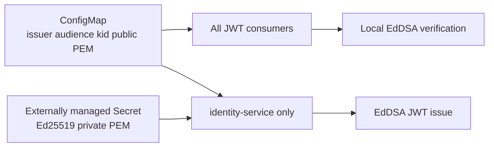

# Kubernetes JWT Configuration Delivery

## Approval Gate

- Status: Approved pending document review
- Approver: user
- Decision: Kubernetes-first configuration delivery; do not add a JWT Config Server, Spring Cloud Config Server, OAuth2 Authorization Server, or OAuth2 clients in this slice.
- Blocking ambiguity: deployment manifests are not yet present; this slice introduces only configuration-delivery manifests and validation, not service deployments.

## Goal

- Make the existing Ed25519 JWT runtime configuration deployable without embedding secrets in source or container images.
- Provide one Kubernetes-native contract usable by Java and future non-Java services.
- Add a deterministic validation command that checks manifests without requiring a running application.

## Non-goals

- OAuth2/OIDC protocol endpoints, JWK discovery, remote JWKS, Spring Cloud Config, runtime refresh, automatic key rotation, or an external-secret controller installation.
- Committing a production private key, generated Secret value, or cloud-provider credentials.

## Architecture

## Configuration Contract

- ConfigMap contains `discord.auth.jwt.issuer`, `discord.auth.jwt.audience`, `discord.auth.jwt.key-id`, and `discord.auth.jwt.public-key-locations.<kid>`.
- A Kubernetes Secret named by the manifest supplies only `discord.auth.jwt.private-key-location` or the mounted private-key file for `identity-service`.
- Public-key consumers mount ConfigMap data read-only; they do not mount the private-key Secret.
- Spring Boot imports mounted files through `spring.config.import=optional:configtree:/etc/discord-config/`.
- Development uses an ignored local secret file or explicit environment variables. Production Secret material is created by the cluster secret workflow; no value is committed.

## Expected Changed Files

- `infra/kubernetes/jwt-config/` — ConfigMap, Secret reference template, Kustomize entrypoint, and namespace-neutral mounts/contract.
- `qa/verify-jwt-kubernetes-config.sh` — render manifests, reject private-key data in ConfigMaps, verify consumer/identity mount separation, optionally run server dry-run when a cluster is selected.
- `backend/**/src/main/resources/application.yml` or shared runtime config — opt-in `configtree:` import without weakening local/test configuration.
- `docs/` and wiki — operator setup, key rotation, verification commands, and residual risk.

## Invariants

- Private PEM is available only to identity-service.
- ConfigMap never contains `PRIVATE KEY`, token, password, or Secret data.
- All services receive issuer, audience, active `kid`, and public-key location before startup.
- Missing configuration fails closed; no default signing key exists.
- Key rotation is two-phase: distribute old+new public keys, switch identity active `kid`, then retire old key after access-token TTL.

## Verification Gates

- `qa/verify-jwt-kubernetes-config.sh` renders all manifests and rejects illegal private-key placement.
- `kubectl kustomize infra/kubernetes/jwt-config` succeeds when `kubectl` is available.
- Optional cluster gate: `kubectl apply --dry-run=server -k infra/kubernetes/jwt-config`.
- Existing Ed25519 Gradle regression gates remain green.

## Review Score Preset

- Preset: Security Review
- Pass threshold: 90/100; no P0/P1 finding.
