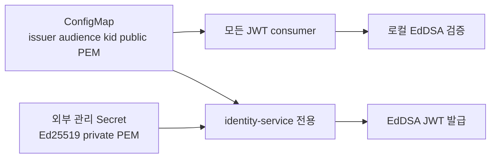

# Kubernetes JWT 설정 전달

## 승인 게이트

- 상태: 문서 검토 대기 승인
- 승인자: 사용자
- 결정: Kubernetes-first 설정 전달을 사용한다. 이 슬라이스에서 JWT Config Server, Spring Cloud Config Server, OAuth2 Authorization Server, OAuth2 client는 추가하지 않는다.
- 차단 모호성: 서비스 배포 manifest는 아직 없다. 이 슬라이스는 서비스 배포가 아닌 설정 전달 manifest와 검증만 도입한다.

## 목표

- 비밀값을 소스·컨테이너 이미지에 포함하지 않고 기존 Ed25519 JWT 런타임 설정을 배포한다.
- Java와 이후 비Java 서비스가 함께 쓰는 Kubernetes-native 계약을 제공한다.
- 실행 중인 애플리케이션 없이 manifest를 확인하는 결정적 검증 명령을 추가한다.

## 비목표

- OAuth2/OIDC protocol endpoint, JWK discovery, remote JWKS, Spring Cloud Config, runtime refresh, 자동 키 순환, 외부 Secret controller 설치.
- 운영 private key, 생성된 Secret 값, cloud-provider 자격 증명 커밋.

## 아키텍처

## 설정 계약

- ConfigMap은 `discord.auth.jwt.issuer`, `discord.auth.jwt.audience`, `discord.auth.jwt.key-id`, `discord.auth.jwt.public-key-locations.<kid>`를 포함한다.
- manifest가 이름을 참조하는 Kubernetes Secret은 `identity-service`의 `discord.auth.jwt.private-key-location` 또는 mount된 private-key 파일만 제공한다.
- 공개키 consumer는 ConfigMap 데이터를 read-only mount하며 private-key Secret을 mount하지 않는다.
- Spring Boot는 `spring.config.import=optional:configtree:/etc/discord-config/`로 mount 파일을 import한다.
- 개발은 ignore된 local secret 파일 또는 명시적 환경 변수를 쓴다. 운영 Secret은 cluster secret workflow가 생성하며 값은 커밋하지 않는다.

## 예상 변경 파일

- `infra/kubernetes/jwt-config/` — ConfigMap, Secret 참조 template, Kustomize entrypoint, namespace-neutral mount/계약.
- `qa/verify-jwt-kubernetes-config.sh` — manifest render, ConfigMap private-key 금지, consumer/identity mount 분리 확인, 선택적 server dry-run.
- `backend/**/src/main/resources/application.yml` 또는 shared runtime config — local/test 설정을 약화하지 않는 opt-in `configtree:` import.
- `docs/`와 wiki — 운영자 설정, 키 순환, 검증 명령, 잔여 위험.

## 불변 조건

- private PEM은 identity-service만 사용한다.
- ConfigMap은 `PRIVATE KEY`, token, password, Secret 데이터를 포함하지 않는다.
- 모든 서비스는 시작 전 issuer, audience, active `kid`, public-key location을 받는다.
- 설정이 없으면 fail closed하며 default signing key는 없다.
- 키 순환은 두 단계다: old+new public key 배포, identity active `kid` 전환, access-token TTL 이후 old key 제거.

## 검증 게이트

- `qa/verify-jwt-kubernetes-config.sh`는 모든 manifest를 render하고 잘못된 private-key 배치를 거부한다.
- `kubectl` 사용 가능 시 `kubectl kustomize infra/kubernetes/jwt-config`가 성공한다.
- 선택적 cluster gate: `kubectl apply --dry-run=server -k infra/kubernetes/jwt-config`.
- 기존 Ed25519 Gradle regression gate는 계속 green이어야 한다.

## 리뷰 점수 기준

- Preset: Security Review
- 통과 기준: 90/100, P0/P1 finding 없음.
