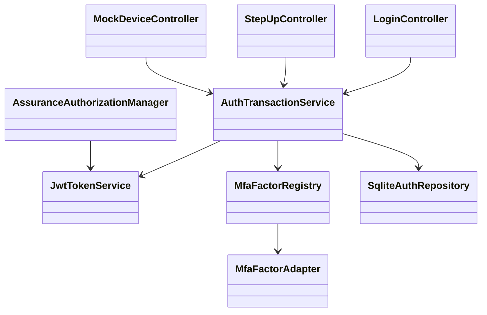
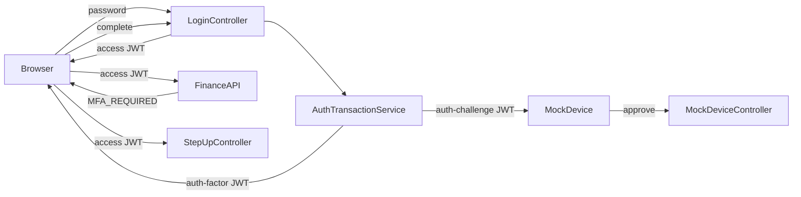

# Spring Security 7 JWT MFA 예제 설계

## 목표

`examples/mfa-spring-security7`에 기존 백엔드와 빌드가 독립된 Spring Boot 예제를 만든다. 이 예제는 SQLite, JWT, Spring Security 7을 사용해 다음 두 인증 흐름을 보여 준다.

1. 로그인 factor를 모두 완료한 뒤에만 access JWT를 발급한다.
2. 이미 로그인된 사용자가 더 높은 신뢰도를 요구하는 API에 접근할 때 별도 step-up factor를 완료해 더 높은 level의 access JWT를 발급한다.

MFA 완료 여부와 신뢰도는 같은 개념이 아니다. factor별 level은 application 설정이 소유하며, access JWT의 `assurance_level`은 통과한 factor level 중 최댓값이다.

## 범위와 제외 범위

포함:

- Spring Boot 4.1.1 / Spring Security 7.1.1 / Java 21.
- SQLite 기반 사용자, 인증 transaction, factor challenge 저장.
- 로그인 정책: `password`와 `mock-login-push`를 모두 요구.
- step-up 정책: `mock-step-up` factor를 요구하는 `finance` 정책.
- `ServiceLoader<MfaFactorAdapter>` plugin 탐색과 Spring Bean adapter fallback.
- Mock push 승인 흐름, JWT 발급/검증, level 기반 API 인가, 테스트와 실행 문서.

제외:

- 실제 NAVER, SMS, TOTP, Passkey/WebAuthn provider 연동.
- factor enrollment, 기기 관리, trusted device, refresh token, JWT logout/revocation.
- 동적 plugin 파일 업로드 또는 runtime classloader 관리.
- production key rotation, distributed transaction store, rate limit, notification delivery 재시도.

## 용어

| 용어 | 의미 |
|---|---|
| Login factor | access JWT 발급 전 로그인 정책을 만족시키는 factor. |
| Step-up factor | 기존 access JWT의 level을 높이기 위해 실행하는 factor. |
| Factor level | application 설정이 `factorId`에 부여하는 양의 정수 신뢰도. |
| Assurance level | JWT에 기록되는 현재 인증 결과의 최고 factor level. |
| Auth-factor JWT | 추가 factor 인증이 필요할 때 browser가 보유하는 짧은 수명의 JWT. API access 권한이 없다. |
| Auth-challenge JWT | 특정 factor challenge를 승인할 device가 보유하는 짧은 수명의 JWT. API access 권한이 없다. |

## 정책과 level

기본 설정은 아래 의미를 갖는다.

```yaml
app:
  auth:
    factors:
      password: 10
      mock-login-push: 50
      mock-step-up: 80
    login:
      required-factor-ids: [password, mock-login-push]
    step-up-policies:
      finance:
        required-factor-ids: [mock-step-up]
        required-level: 80
```

로그인 정책을 통과하면 `max(10, 50) = 50`의 access JWT를 발급한다. `finance`는 level 80을 요구하므로 level 50 access JWT는 거부되고 step-up을 거친 뒤 level 80 JWT를 발급한다.

factor level은 adapter의 반환값이나 client 요청값이 아니다. application 설정에서만 결정한다. 따라서 client가 낮은 factor를 높은 level로 위장하거나 plugin이 임의 level을 발급할 수 없다.

## 인증 흐름

### 로그인

```text
POST /api/login
  password 검증 성공
  -> LOGIN transaction 생성
  -> password factor 완료 기록
  -> mock-login-push challenge 생성
  -> auth-factor JWT와 auth-challenge JWT 반환

Mock device가 auth-challenge JWT로 approve
  -> mock-login-push factor 완료 기록

POST /api/login/transactions/{transactionId}/complete
  auth-factor JWT 제시
  -> login.required-factor-ids 전체 완료 확인
  -> assurance_level=50 access JWT 발급
```

비밀번호만 맞아도 access JWT를 발급하는 경로는 없다.

### Step-up

```text
GET /api/finance/summary with access JWT(level 50)
  -> 403 MFA_REQUIRED(requiredLevel=80, policyId=finance)

POST /api/step-up/transactions { "policyId": "finance" }
  -> STEP_UP transaction과 mock-step-up challenge 생성
  -> auth-factor JWT와 auth-challenge JWT 반환

Mock device가 auth-challenge JWT로 approve
  -> mock-step-up factor 완료 기록

POST /api/step-up/transactions/{transactionId}/complete
  auth-factor JWT 제시
  -> policy factor 완료 확인
  -> assurance_level=max(50, 80)=80 access JWT 발급
```

step-up은 기존 access JWT의 subject와 level에 묶인다. transaction을 완료할 때 현재 level보다 낮은 factor를 통과해도 JWT level은 낮아지지 않는다.

## 토큰 계약

### Access JWT

Access JWT만 Resource Server가 API 인증에 사용한다.

| Claim | 의미 |
|---|---|
| `typ` | `access` |
| `sub` | 사용자 ID |
| `jti` | 토큰 식별자 |
| `iss`, `iat`, `exp` | 표준 발급자 및 수명 claim |
| `assurance_level` | 통과 factor의 최대 level |
| `amr` | 완료한 factor ID 목록 |

일반 access JWT TTL은 30분, step-up으로 발급한 access JWT TTL은 5분이다.

### Auth-factor JWT

로그인과 step-up에서 추가 factor 인증이 필요할 때 browser에 발급한다.

| Claim | 의미 |
|---|---|
| `typ` | `auth-factor` |
| `sub` | 대상 사용자 ID |
| `transaction_id` | SQLite transaction ID |
| `purpose` | `LOGIN` 또는 `STEP_UP` |
| `exp` | 5분 이내의 짧은 만료 |

Auth-factor JWT는 해당 transaction의 상태 조회·완료 API에서만 명시적으로 검증한다.

### Auth-challenge JWT

특정 challenge의 승인 권한을 인증 device에 전달한다. Mock 예제에서는 응답에 포함해 test client가 device 역할을 재현한다. 실제 push provider에서는 이 토큰을 browser 응답이 아니라 등록 device에 전달한다.

| Claim | 의미 |
|---|---|
| `typ` | `auth-challenge` |
| `sub` | 대상 사용자 ID |
| `transaction_id` | SQLite transaction ID |
| `challenge_id` | 승인 가능한 단일 challenge ID |
| `factor_id` | 승인 대상 factor ID |
| `purpose` | `LOGIN` 또는 `STEP_UP` |
| `exp` | challenge와 같은 짧은 만료 |

Auth-challenge JWT는 mock device 승인 API에서만 검증하며, 다른 challenge나 transaction의 승인에는 사용할 수 없다. Security 설정은 `typ=access`만 bearer access JWT로 받아들인다.

## Factor adapter SPI

```java
public interface MfaFactorAdapter {
    String factorId();
    FactorChallenge start(FactorChallengeContext context);
    FactorVerification verify(FactorVerificationContext context);
}
```

공통 interface는 OTP code, WebAuthn assertion, push callback 같은 factor별 입력을 고정하지 않는다. `publicPayload`, `verificationPayload`, `adapterState`는 JSON payload이며, `adapterState`는 해당 adapter만 해석한다.

`MfaFactorRegistry`는 먼저 classpath의 `ServiceLoader` provider를 읽고, Spring Bean 구현을 합친다. 같은 `factorId`가 중복되면 시작을 실패한다.

MVP adapter:

- `mock-login-push`: login 전용 mock push 승인 factor, level 50.
- `mock-step-up`: step-up 전용 mock push 승인 factor, level 80.

두 adapter는 Mock device endpoint에서 승인되기 전까지 `PENDING` 상태를 유지한다. Mock device endpoint는 해당 challenge에 묶인 auth-challenge JWT를 검증한 뒤에만 승인한다. 이 endpoint는 예제 전용이며 실제 device proof를 대체하지 않는다. 실제 Passkey/WebAuthn adapter는 같은 SPI 안에서 public challenge와 assertion 검증을 구현한다.

## HTTP API

| API | 인증 | 결과 |
|---|---|---|
| `POST /api/login` | 없음 | password 검증 후 LOGIN transaction, auth-factor JWT, auth-challenge JWT 반환 |
| `POST /api/login/transactions/{id}/complete` | auth-factor JWT | 모든 login factor 완료 시 access JWT 반환 |
| `POST /api/step-up/transactions` | access JWT | 정책 기반 STEP_UP transaction, auth-factor JWT, auth-challenge JWT 반환 |
| `POST /api/step-up/transactions/{id}/complete` | auth-factor JWT | 정책 factor 완료 시 승급 access JWT 반환 |
| `POST /api/mock-device/challenges/{id}/approve` | auth-challenge JWT | 해당 push challenge를 승인 상태로 변경 |
| `GET /api/profile` | access JWT | 현재 user와 assurance level 반환 |
| `GET /api/finance/summary` | access JWT + level 80 | level 충족 시 금융 예제 데이터 반환 |

`POST /api/login`과 `POST /api/step-up/transactions` 응답은 생성된 transaction ID, auth-factor JWT, auth-challenge JWT, pending challenge ID와 public payload를 함께 반환한다. browser는 mock device의 별도 승인 뒤 auth-factor JWT로 `complete` API를 호출한다. `/api/finance/summary`의 level 부족 응답은 `403 MFA_REQUIRED`이며 `currentLevel`, `requiredLevel`, `policyId`를 포함한다. 토큰 없음·서명 오류·만료·잘못된 token type은 `401`이다. 만료 또는 소비 완료 transaction/challenge는 `410`이다.

## SQLite 모델

```text
users
- id TEXT PRIMARY KEY
- email TEXT UNIQUE NOT NULL
- password_hash TEXT NOT NULL
- created_at TEXT NOT NULL

auth_transactions
- id TEXT PRIMARY KEY
- user_id TEXT NOT NULL
- purpose TEXT NOT NULL                 -- LOGIN | STEP_UP
- source_assurance_level INTEGER        -- STEP_UP에만 존재
- required_factor_ids_json TEXT NOT NULL
- completed_factor_ids_json TEXT NOT NULL
- expires_at TEXT NOT NULL
- completed_at TEXT
- created_at TEXT NOT NULL

factor_challenges
- id TEXT PRIMARY KEY
- transaction_id TEXT NOT NULL
- factor_id TEXT NOT NULL
- adapter_state_json TEXT NOT NULL
- public_payload_json TEXT NOT NULL
- approved_at TEXT
- consumed_at TEXT
- expires_at TEXT NOT NULL
- created_at TEXT NOT NULL
```

transaction 완료는 한 transaction의 모든 `required_factor_ids`가 완료됐는지 확인한 뒤, `completed_at IS NULL` 조건으로 원자적으로 처리한다. 이 조건에 실패하면 access JWT를 발급하지 않는다.

## Spring Security 구성

- `SecurityFilterChain`은 stateless bearer JWT Resource Server로 설정한다.
- `JwtDecoder`와 `JwtEncoder`는 MVP HMAC key를 사용한다. key는 환경 변수로 주입하고, 짧거나 기본값인 production key는 허용하지 않는다.
- JWT converter는 `assurance_level`을 인증 principal에 노출한다.
- `AssuranceAuthorizationManager`는 path별 정책의 `requiredLevel <= assurance_level`만 판정한다.
- CSRF는 cookie/session 인증을 사용하지 않는 JSON bearer API이므로 비활성화한다.
- password는 Spring Security `PasswordEncoder`로 hash한다.
- raw password, access/auth-factor/auth-challenge JWT, adapter state는 로그로 남기지 않는다.

Spring Security 7의 MFA authority 기능은 사용하지 않는다. 이 예제의 정책은 임의 개수 factor와 숫자 level을 다루므로 `AuthorizationManager` 기반 인가가 책임 경계에 맞다.

## 테스트와 검증

단위 테스트:

- level 최대값 계산, login/step-up required factor 충족 여부.
- auth-factor/auth-challenge JWT type, purpose, transaction·challenge binding 검증.
- adapter registry의 ServiceLoader/Spring Bean 등록과 중복 factor ID 거부.
- Mock push의 pending/approve/consume 동작.

통합 테스트:

1. password만 완료한 login transaction은 access JWT를 받지 못한다.
2. login push 승인 후 level 50 access JWT를 받는다.
3. level 50은 `GET /api/finance/summary`에서 `403 MFA_REQUIRED`를 받는다.
4. step-up 승인 후 level 80 access JWT로 금융 API를 호출한다.
5. transaction/challenge 재사용, 만료, 다른 사용자의 transaction 접근, auth-factor/auth-challenge JWT로 API 접근은 거부된다.

검증 명령:

```bash
../../gradlew -p examples/mfa-spring-security7 test
../../gradlew -p examples/mfa-spring-security7 bootRun
```

## 구현 순서

1. 독립 Gradle 프로젝트와 SQLite schema를 만든다.
2. 사용자 seed, password login, JWT encoder/decoder와 access token filter를 만든다.
3. transaction 저장소와 auth-factor/auth-challenge JWT를 만든다.
4. ServiceLoader/Spring Bean adapter registry와 두 mock push adapter를 만든다.
5. login 및 step-up controller/service를 만든다.
6. level 인가와 오류 응답을 만든다.
7. 단위·통합 테스트와 README의 curl 실행 예제를 작성한다.

## 구현 blueprint

### Approval Gate

- Status: Approved
- Approver: 사용자
- Blocking ambiguity: 없음
- Competing plan branches: 없음. 현재 design 문서가 구현 기준이다.

### Task Packet

```text
Task ID: MFA
Goal: 독립 Spring Security 7 JWT MFA MVP
Domain: login factor, step-up factor, assurance level
Allowed write paths: examples/mfa-spring-security7/**, .gitignore, docs/superpowers/specs/2026-09-01-mfa-spring-security7-design.md
Forbidden changes: 기존 backend/**, root Gradle settings, 외부 인증 provider, 실제 NAVER 연동
Affected endpoints: /api/login, /api/login/transactions/**, /api/step-up/transactions/**,
  /api/mock-device/challenges/**, /api/profile, /api/finance/summary
Persistence/runtime: example-local SQLite only
Expected tests: factor registry 단위 테스트, 전체 login/step-up MockMvc 흐름
```

### Participating Code

| 구성 요소 | 책임 |
|---|---|
| `SecurityConfiguration` | `typ=access` JWT만 Resource Server bearer authentication으로 허용하고 level 인가를 연결한다. |
| `JwtTokenService` | access, auth-factor, auth-challenge JWT를 각각 발급·검증한다. |
| `AuthTransactionService` | LOGIN/STEP_UP transaction, factor 완료 여부, max level과 일회성 완료를 관리한다. |
| `MfaFactorRegistry` | ServiceLoader와 Spring Bean adapter를 합치고 factor ID 중복을 거부한다. |
| `MfaFactorAdapter` | factor-specific challenge 시작·승인 검증의 공통 port다. |
| Mock push adapters | login과 step-up의 `PENDING → APPROVED` mock 흐름을 제공한다. |
| `SqliteAuthRepository` | 사용자, transaction, challenge 상태를 query-shaped JDBC로 저장한다. |
| Controllers | HTTP DTO 검증과 token type별 caller 경계를 담당한다. |

### Expected Changed Files

| Path | Expected change |
|---|---|
| `.gitignore` | example-local SQLite database file ignore |
| `examples/mfa-spring-security7/settings.gradle.kts` | 독립 Gradle project name |
| `examples/mfa-spring-security7/build.gradle.kts` | Boot 4.1.1, Security Resource Server, JDBC, SQLite, test dependencies |
| `examples/mfa-spring-security7/README.md` | 실행·Mock device 승인·curl MVP walkthrough |
| `examples/mfa-spring-security7/src/main/resources/application.yml` | JWT, SQLite, factor level, login/step-up policy |
| `examples/mfa-spring-security7/src/main/resources/schema.sql` | users, auth_transactions, factor_challenges DDL |
| `examples/mfa-spring-security7/src/main/resources/META-INF/services/...MfaFactorAdapter` | login mock push ServiceLoader provider |
| `examples/mfa-spring-security7/src/main/java/com/example/mfa/**` | application, security, JWT, transaction, adapter, JDBC, controller code |
| `examples/mfa-spring-security7/src/test/java/com/example/mfa/**` | registry and complete HTTP flow regression tests |

### Structure Diagram



### System Flow Diagram



### Invariants And Boundaries

- `access` type 이외의 JWT는 Resource Server bearer authentication으로 인정하지 않는다.
- auth-factor JWT는 자기 transaction에서만, auth-challenge JWT는 자기 challenge에서만 쓸 수 있다.
- client request는 factor level 또는 사용자 ID를 정하지 않는다. user ID는 JWT subject 또는 password lookup에서만 정한다.
- access JWT level은 완료 factor configured level의 최댓값이고 step-up에서 낮아지지 않는다.
- transaction 및 challenge 완료는 만료 전 한 번만 성공한다.
- raw password와 세 종류 JWT, adapter state는 로그에 기록하지 않는다.
- mock device 승인 endpoint는 demo contract이며 real possession proof가 아님을 README에 명시한다.

### Verification Gates

- RED/GREEN: 각 새 동작은 JUnit test를 먼저 작성해 missing behavior로 실패를 확인한다.
- Focused: `../../gradlew -p examples/mfa-spring-security7 test`.
- Runtime: `../../gradlew -p examples/mfa-spring-security7 bootRun` 후 README curl flow.
- Security negative: access 전 login 완료 차단, wrong JWT type 차단, 다른 transaction/challenge 차단, 만료·재사용 차단, level 부족 `403 MFA_REQUIRED`.

## 알려진 한계와 향후 확장

- Mock device approve endpoint는 실제 기기 소유 proof가 아니다. production adapter는 signed callback, push provider 상태 조회, 또는 WebAuthn assertion으로 대체해야 한다.
- level의 `max` 규칙은 사용자 요청에 따른 예제 계약이다. 실제 보안 정책은 factor 조합·인증 freshness·risk signal을 함께 기준으로 삼을 수 있다.
- HMAC key는 단일 서비스 MVP에 적합하다. 여러 resource server 또는 key rotation이 필요한 경우 RSA/Ed25519 key pair와 `kid` 기반 검증으로 전환한다.

## MVP 구현 반영 메모

- 독립 프로젝트는 `examples/mfa-spring-security7`에 있으며 root Gradle build에는 포함하지 않는다.
- 실행 스키마는 MVP에 필요한 `state`, `approved_at`, `expires_at`만 저장한다. adapter 상태·공개 payload의 영속화와 audit event는 실제 provider adapter를 도입할 때 추가한다.
- `auth-factor JWT`와 `auth-challenge JWT`는 Resource Server의 Bearer 인증 경로를 통과하지 않는다. 각각 `X-Auth-Factor-Token`, `X-Auth-Challenge-Token`에서 controller가 type·subject·transaction/challenge binding을 검증한다.
- 여러 login/step-up challenge를 만들 수 있도록 응답은 `challenges[]`에 challenge별 `authChallengeToken`을 둔다. 현재 기본 정책에는 login과 step-up 모두 mock push 하나만 있다.
- 구현은 MVP 응집도를 위해 application/security/JWT/transaction/JDBC 흐름을 `MfaApplication.java`에 모았다. adapter SPI는 외부 연결 지점이므로 별도 파일로 유지한다.
- 테스트 실행은 로컬 Gradle의 loopback 연결 제약 때문에 사용자 승인으로 보류했다. 정적 MockMvc regression test는 먼저 작성했으며, 환경이 정상화되면 `gradle test`와 README flow를 실행한다.
